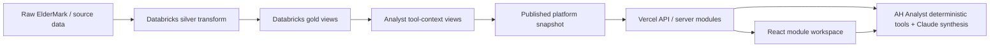

# Alamo Platform Handbook

- purpose: canonical entry point for the current Alamo Platform product, runtime, data publishing path, and analyst workspace
- status: authoritative current-state handbook
- owners: product, engineering, data platform
- updated: 2026-07-18
- tags: alamo-platform, architecture, analyst, snapshot, databricks, operations
- labels: platform-handbook, current-state, authoritative
- related files:
  - [architecture.md](/Users/eric/CareEngineMain/alamo-platform-app/docs/platform/architecture.md)
  - [integration-platform.md](/Users/eric/CareEngineMain/alamo-platform-app/docs/platform/integration-platform.md)
  - [product-surfaces.md](/Users/eric/CareEngineMain/alamo-platform-app/docs/platform/product-surfaces.md)
  - [full-reporting.md](/Users/eric/CareEngineMain/alamo-platform-app/docs/platform/full-reporting.md)
  - [user-journeys.md](/Users/eric/CareEngineMain/alamo-platform-app/docs/platform/user-journeys.md)
  - [analyst-system.md](/Users/eric/CareEngineMain/alamo-platform-app/docs/platform/analyst-system.md)
  - [data-publishing.md](/Users/eric/CareEngineMain/alamo-platform-app/docs/platform/data-publishing.md)
  - [deployment-operations.md](/Users/eric/CareEngineMain/alamo-platform-app/docs/platform/deployment-operations.md)
  - [testing-quality.md](/Users/eric/CareEngineMain/alamo-platform-app/docs/platform/testing-quality.md)
  - [ship-checklist.md](/Users/eric/CareEngineMain/alamo-platform-app/docs/platform/ship-checklist.md)
  - [repository-ownership.md](/Users/eric/CareEngineMain/alamo-platform-app/docs/platform/repository-ownership.md)

## Scope

This handbook documents the Alamo Platform web app and its supporting publish,
snapshot, analyst, authentication, and deployment systems. Medication/MAR data
is covered only where it feeds platform analytics, snapshot diagnostics, and AH
Analyst tools.

## Current Product In One Sentence

Alamo Platform is a Microsoft Entra-protected, snapshot-first operating
workspace where users choose vetted AH Analyst questions, receive deterministic
answers and reusable modules in a chat-style canvas, and drill into Communities
and Incidents without rebuilding the app from live warehouse queries on every
page load.

## Current Runtime Shape

## Read Order

1. [architecture.md](/Users/eric/CareEngineMain/alamo-platform-app/docs/platform/architecture.md) for system boundaries and data flow.
2. [integration-platform.md](/Users/eric/CareEngineMain/alamo-platform-app/docs/platform/integration-platform.md) for the approved path from the current Alamo implementation to a reusable EHR, eMAR, and analytics integration platform.
3. [product-surfaces.md](/Users/eric/CareEngineMain/alamo-platform-app/docs/platform/product-surfaces.md) for the current routes and user-facing modules.
4. [user-journeys.md](/Users/eric/CareEngineMain/alamo-platform-app/docs/platform/user-journeys.md) for the named operator journeys and scenario coverage.
5. [full-reporting.md](/Users/eric/CareEngineMain/alamo-platform-app/docs/platform/full-reporting.md) for governed long-form reports, artifacts, and the reporting data roadmap.
6. [analyst-system.md](/Users/eric/CareEngineMain/alamo-platform-app/docs/platform/analyst-system.md) for AH Analyst, deterministic tools, session state, and module rendering.
7. [data-publishing.md](/Users/eric/CareEngineMain/alamo-platform-app/docs/platform/data-publishing.md) for Databricks notebooks, workflow order, snapshot artifacts, and freshness.
8. [deployment-operations.md](/Users/eric/CareEngineMain/alamo-platform-app/docs/platform/deployment-operations.md) for local/Vercel/env/auth/health procedures.
9. [testing-quality.md](/Users/eric/CareEngineMain/alamo-platform-app/docs/platform/testing-quality.md) for verification scripts, performance budgets, and known quality gates.
10. [ship-checklist.md](/Users/eric/CareEngineMain/alamo-platform-app/docs/platform/ship-checklist.md) for the final release gate.
11. [repository-ownership.md](/Users/eric/CareEngineMain/alamo-platform-app/docs/platform/repository-ownership.md) for the file-retention contract.

## Source Of Truth Rules

- The app reads current operating surfaces from published snapshot artifacts
  first, except the live Incident Center feed.
- Deterministic tools own calculations, row filtering, period selection, scope,
  metric grain, validation, and CSV row identity.
- Claude/AH Analyst synthesis may explain verified tool evidence, but it must
  not invent data, substitute periods, or repair invalid tool scope in prose.
- Most common operator questions should resolve through deterministic
  capabilities without Claude; use Claude only for high-leverage synthesis over
  verified evidence.
- Routes still exist for deep links, but the primary product model is a
  chat/module workspace rather than a traditional sidebar/page app.
- The handbook and five explicitly linked implementation references are the
  complete active documentation set. Dated plans and completed backlogs do not
  remain in the repository.

## Current High-Risk Areas

- `WorkspaceHomePage.tsx` and `copilot-tools.mjs` remain orchestration pressure
  points. Their render/data/detection concerns are extracted and growth budgets
  are enforced; future work must extend named domains instead of appending branches.
- MAR/medication context exists in the data pipeline and analyst tools, but the
  platform UI still needs careful product decisions before surfacing more of it.
- Local verification can be blocked by Entra or live Databricks credentials;
  use script checks and deployed health endpoints when a local browser cannot
  authenticate.

## Daily Operator Mental Model

1. Databricks refreshes source/silver/gold data.
2. Tool-context and QA notebooks verify analyst-facing views.
3. Snapshot publish writes `snapshots/daily/latest.json` and a dated copy.
4. Certified cache and analyst QA artifacts are regenerated from that data cut.
5. Vercel serves the app, APIs read snapshot/artifacts, and Incident Center uses
   the live incident endpoint with snapshot fallback.
