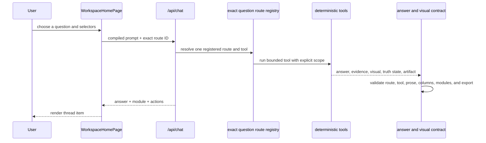

# AH Analyst System

- purpose: explain the current platform analyst architecture, deterministic tools, session state, and failure controls
- status: authoritative current-state reference
- owners: product, backend, frontend
- updated: 2026-07-22
- tags: analyst, claude, tools, session-state, modules, qa
- labels: platform-handbook, current-state
- related files:
  - [alamo-platform-app/api/chat.js](/Users/eric/CareEngineMain/alamo-platform-app/api/chat.js)
  - [alamo-platform-app/server/claude-copilot.mjs](/Users/eric/CareEngineMain/alamo-platform-app/server/claude-copilot.mjs)
  - [alamo-platform-app/server/copilot-tools.mjs](/Users/eric/CareEngineMain/alamo-platform-app/server/copilot-tools.mjs)
  - [alamo-platform-app/server/tools/registry.mjs](/Users/eric/CareEngineMain/alamo-platform-app/server/tools/registry.mjs)
  - [alamo-platform-app/server/tools/incidents.mjs](/Users/eric/CareEngineMain/alamo-platform-app/server/tools/incidents.mjs)
  - [alamo-platform-app/shared/query-intent-compiler.mjs](/Users/eric/CareEngineMain/alamo-platform-app/shared/query-intent-compiler.mjs)
  - [alamo-platform-app/shared/analysis-session-state.mjs](/Users/eric/CareEngineMain/alamo-platform-app/shared/analysis-session-state.mjs)
  - [alamo-platform-app/shared/analyst-capability-registry.mjs](/Users/eric/CareEngineMain/alamo-platform-app/shared/analyst-capability-registry.mjs)
  - [alamo-platform-app/shared/certified-analyst-questions.mjs](/Users/eric/CareEngineMain/alamo-platform-app/shared/certified-analyst-questions.mjs)
  - [alamo-platform-app/shared/guided-question-contracts.mjs](/Users/eric/CareEngineMain/alamo-platform-app/shared/guided-question-contracts.mjs)
  - [alamo-platform-app/shared/analysis-slice-catalog.mjs](/Users/eric/CareEngineMain/alamo-platform-app/shared/analysis-slice-catalog.mjs)
  - [analysis-session-state-spec.md](/Users/eric/CareEngineMain/alamo-platform-app/docs/reference/analysis-session-state-spec.md)
  - [platform-module-registry-spec.md](/Users/eric/CareEngineMain/alamo-platform-app/docs/reference/platform-module-registry-spec.md)

## Purpose

AH Analyst is the platform's bounded analysis layer. It should feel like an
analyst, but calculations and row selection must stay deterministic.

## Current Request Flow

The current home experience is question-menu first. Its search box searches
registered questions; it is not a free-text analysis composer. A menu click
sends the route ID, so the backend does not rediscover intent from the rendered
question text. The free-text compiler remains an internal compatibility layer
for old history items, reruns, and tightly bounded tool actions. It is not the
primary product path.

Normal answers may offer a short deterministic drilldown ladder. A visible
next-question action must carry an exact registered question-route ID. The
frontend sends that route ID with the inherited `AnalysisFrame`, so the next
turn changes the analysis family while preserving the selected community,
period, category, or resident. Unregistered generated prompts are not shown.

## Hard Rule

The LLM does not own the data contract.

Application code owns:

- intent compilation
- metric grain
- period selection
- community/resident scope
- category filters
- current-versus-historical eligibility
- deterministic tool selection
- row filtering and calculation
- post-result validation
- CSV/export identity
- truth state

Claude may:

- synthesize verified tool results
- explain supported comparisons
- write concise user-facing prose
- suggest relevant follow-ups

Claude must not:

- substitute a nearby period without user consent
- turn a not-loaded state into an answer
- infer missing resident/MAR/census rows from narrative text
- compute hidden replacement totals when tools failed validation

## Governed One-Page Briefs

A completed saved-question answer may expose one quiet **Create one-page
brief** action. The action is available only when the same result has all of
the following affirmative proof:

- a current registered question-route ID
- `valid_rows` or `verified_zero` truth
- successful runtime schema validation
- successful execution-plan validation
- successful guided-question contract validation
- no safe refusal or contract violation

The user chooses an audience and emphasis from bounded options. The server
revalidates the evidence, verifies that every route still exists in the
question registry, and builds a letter-sized HTML one-pager. The user can
download it or open the print view to save a PDF. The compact evidence capsule
is retained in sanitized chat history, so a restored thread can recreate the
same brief.

When `GOVERNED_REPORT_SYNTHESIS_ENABLED` is not `false` and Anthropic is
configured, Claude may turn the verified answer set into concise prose. It
cannot select data, calculate, introduce a number absent from the evidence, or
recover a failed answer. Invalid JSON, ungrounded numbers, semicolons, timeout,
overload, or any model failure falls back to deterministic report prose.

Email delivery is server-only and optional. The browser never receives mail
credentials. Delivery is hidden until a narrow HTTPS webhook, shared secret,
and organization-domain allowlist are configured. The webhook receives
rendered HTML plus an idempotency key and must deduplicate repeated keys.

## Weekly Briefings

The weekly runner composes the same registered question routes used in the
interactive workspace. It does not run arbitrary prompts.

- executive: operating snapshot, community comparison, current incidents, and medication compliance
- operations: census movement, incident rate, current incidents, and medication compliance
- clinical: medication compliance, diagnosis mix, and current incidents
- community leader: community status, incident categories, and medication compliance history for that community

Each audience is isolated. A failed plan is recorded without preventing the
other plans from completing. Missing recipients cause a safe skip. Scheduled
delivery uses a stable key built from the week, data month, and plan ID so
Vercel retries cannot create duplicate mail when the webhook honors that key.
The default Vercel schedule is Monday and can be changed in `vercel.json`.

## Session State

The shared state object is `AnalysisFrame`.

It tracks:

- metric
- metric grain, such as unique residents versus incident rows
- category
- mode: aggregate, detail, comparison, trend, profile
- periods
- grouping
- requested fields
- export intent
- community/facility scope
- resident scope
- calculation type
- presentation type
- source prompt

Follow-ups patch this frame:

- "Do it for April" changes period only.
- "Now San Pablo" changes community only.
- "Export that" changes export only.
- "Just totals" changes mode and clears detail fields.
- broad profile/topline questions reset stale thread context.

New Chat creates a new session ID and clears the frame.

## Certified Rails

Common high-risk questions are registered in:

- [certified-analyst-questions.mjs](/Users/eric/CareEngineMain/alamo-platform-app/shared/certified-analyst-questions.mjs)

Certified families must also have a capability contract in:

- [analyst-capability-registry.mjs](/Users/eric/CareEngineMain/alamo-platform-app/shared/analyst-capability-registry.mjs)

Certified rails improve repeatability for:

- AWOL people versus incident event counts
- point-in-time census counts
- incident freshness troubleshooting
- incident breakdowns, detail lists, exports, comparisons, rates
- census trends, movement, and drop history
- resident profiles/search
- medication compliance/refusals/profile
- resident MAR profile and medication exception detail
- medication watchlists for resident-level MAR attention signals
- community operating summaries

Every visible menu question has a stable route ID. The route fixes the question
family and expected tool before execution. Selectors only fill declared
variables such as community, resident, category, and month.

Each family and route is validated against the report contract in:

- [guided-question-contracts.mjs](/Users/eric/CareEngineMain/alamo-platform-app/shared/guided-question-contracts.mjs)

Contracts define allowed truth states, visual types, required columns, required
answer language, artifact requirements, and limits on actions and modules. A
guided answer that violates its contract is stopped before rendering rather
than shown as a partial result.

The frontend must also honor the contracted visual type. A shared data module
does not authorize a different presentation: a direct count remains a KPI
card, even when its source is also used by a chart or trend module.

Certified rails still go through the shared cache policy and execution-plan
validation. Cache keys include the exact route ID in addition to scope, period,
category, resident, grain, mode, fields, and presentation. One question variant
therefore cannot reuse another variant's answer.

The product menu exposes one deliberately selected route for each supported
user task. Parser examples and alternate phrasings remain hidden regression
cases; they do not become duplicate menu questions. Internal diagnostics,
contextual exports, incomplete data families, and duplicate resident/community
surfaces are not eligible for the product menu.

The visible menu currently exposes 31 distinct user tasks. The underlying
registry retains 44 tested families, 205 exact route prompts, and 200 parser
examples. Reducing the menu therefore removes duplicate wording and internal
diagnostics from navigation, not the supported data or contextual follow-up
capabilities.

The strict report-shape gate runs every configured route. A release requires
all 205 routes to score 100 with no review queue. A separate catalog gate
verifies that the smaller visible menu contains only approved, complete routes
and that its first page covers the most common community, census, operating,
incident, resident, and medication tasks. Popular first-page routes also have
explicit minimum narrative and evidence depth. The gates check routing, scope,
truth, lead answer, evidence, visual, interaction count, prose, and product-menu
eligibility.

## Truth States

Tool results should expose a `truthState` so the renderer and analyst can say
the right thing:

- `valid_rows`: loaded rows support the answer.
- `verified_zero`: the slice is loaded and the correct answer is zero.
- `summary_not_shown`: a summary exists but does not prove a zero/detail answer.
- `not_loaded`: the requested period/scope/grain is not loaded.
- `stale`: data exists but is older than freshness expectations.
- `plan_rejected`: the result failed execution-plan validation.

This prevents the recurring failure where "no rows" gets misread as "zero."
Incident freshness uses the same truth-state contract: latest incident detail
behind today is `stale`, current-through-today detail is `valid_rows`, and no
dated incident detail is `not_loaded`.

## Tool Registry

The registry in
[server/tools/registry.mjs](/Users/eric/CareEngineMain/alamo-platform-app/server/tools/registry.mjs)
is fail-closed:

- duplicate tool registration is a startup/programming error
- unknown tool dispatch returns safe refusal, not an exception or hallucinated answer

Incident domain extraction has begun in:

- [server/tools/incidents.mjs](/Users/eric/CareEngineMain/alamo-platform-app/server/tools/incidents.mjs)

Answer formatting lives behind:

- [server/tools/answer-formatting.mjs](/Users/eric/CareEngineMain/alamo-platform-app/server/tools/answer-formatting.mjs)

Execution planning lives behind:

- [server/tools/execution-planning.mjs](/Users/eric/CareEngineMain/alamo-platform-app/server/tools/execution-planning.mjs)

Decision intelligence lives behind:

- [shared/analyst-decision-intelligence.mjs](/Users/eric/CareEngineMain/alamo-platform-app/shared/analyst-decision-intelligence.mjs)

Every execution plan now carries a deterministic decision summary:

- request family: count, detail list, export, profile, trend, comparison, surface, availability, slice, or broad analysis
- expected answer shape: direct count, exact-row preview, CSV artifact, resident profile card, trend module, comparison module, compiled slice module, surface module, or data coverage diagnostic
- risk flags: multi-period, grain-sensitive, exact rows, exact export, category-sensitive, community/resident scope, freshness-sensitive, period-sensitive, and context-sensitive
- module-family hints for supporting context

This gives QA and turn traces a stable way to inspect whether the system
understood the *kind* of work before it rendered the answer.

Every handled tool result also receives a deterministic answer-quality score in
[server/tools/answer-quality.mjs](/Users/eric/CareEngineMain/alamo-platform-app/server/tools/answer-quality.mjs).
The score is not an LLM judgment. It checks the finalized result against the
execution plan and rendered artifacts for intent, data, answer, surface,
display, and recovery quality. It flags issues such as missing requested
periods, expected modules/artifacts not attached, broad exact-row answers
without an artifact, stale facility labels, raw source openings, object leaks,
and unsafe no-row recovery.

The bounded low-PHI trace journal exposes those scores through
`/api/platform/analyst-traces`. Command Center summarizes average answer
quality, low-quality turns, quality flags, decision-family quality, and module
coverage against the platform module registry. This makes the analyst layer
self-auditing: if the app technically answers but starts sounding bad, routing
wrongly, or failing to surface expected modules, the quality gate and Command
Center should show it.

Result finalization lives behind:

- [server/tools/result-finalization.mjs](/Users/eric/CareEngineMain/alamo-platform-app/server/tools/result-finalization.mjs)

Medication/MAR analytics use the same deterministic contract:

- `medication_profile` owns portfolio/community MAR summaries, including compliance, scheduled administrations, not-given administrations, refusals, resident MAR rows, and exception detail.
- `medication_watch` owns current resident-level MAR watchlists ranked by refusals, not-given administrations, low compliance, and PRN activity. It is current-state only and must not substitute current residents for historical-period requests.
- `medication_orders_current` owns exact active order rows for the portfolio or one community, including resident coverage, dose, route, schedule, indication, PRN/psychotropic/narcotic flags, effective dates, end dates, and an exact CSV artifact.
- `medication_compliance` and `medication_refusals_by_community` support explicit monthly periods when governed MAR rows are present in the snapshot.
- `medication_exception_detail` owns row-level refusal, not-given, late, held, and PRN detail. PRN results and follow-up fields come from the complete governed 90-day PRN window. The tool must distinguish loaded-zero results from missing MAR context.
- `resident_lookup` owns resident-level MAR profile answers because a resident question should return the resident card, MAR rollups, and current order rows, not a generic portfolio medication rollup.
- AH Analyst can explain those rows, but it cannot infer MAR, resident, or exception facts that are not loaded.

Custom slice discovery is a deterministic fallback for operator questions that
ask for an ad hoc slice, pivot, grouping, or field set that is not one of the
polished certified paths. The slice catalog lives in
[analysis-slice-catalog.mjs](/Users/eric/CareEngineMain/alamo-platform-app/shared/analysis-slice-catalog.mjs)
and declares loaded datasets, grains, dimensions, measures, and supported
fields. The executor lives in
[server/tools/slice-discovery.mjs](/Users/eric/CareEngineMain/alamo-platform-app/server/tools/slice-discovery.mjs).

Rules for slice discovery:

- certified and polished deterministic tools win first
- explicit `slice`, `pivot`, `group by`, `group X by Y`, `break out`, or custom field prompts can use `slice_discovery`
- known visual modules such as heatmaps stay on their dedicated tools
- plain category/community breakdown prompts stay on `slice_metric`
- loaded slices include incident detail history, incident monthly category rows, census monthly rows, governed MAR monthly rows, complete bounded MAR exception and PRN detail, current medication orders, resident MAR summary, resident incident rollups, enriched resident profile, documentation status, medication refusal summary, and community operating summary
- detail-style slice results preview a bounded table in-chat while preserving the full exact row set as a CSV artifact with row-set provenance
- missing resident incident rollups can be derived from incident detail history; missing resident MAR summaries may fall back to enriched resident rows without inventing MAR counts
- every result still goes through execution-plan validation, truth state, schema validation, and answer formatting

## Module Rendering

Tool results can render modules such as:

- profile card
- data table
- incident detail list
- census trend
- comparison bars
- donut/category composition
- KPI strip
- heatmap

Large detail lists render a preview in chat and preserve full export rows.
Modules should stay focused. Do not add multiple generic actions to every card.

## Current Fallbacks

Preferred failure behavior:

1. Try deterministic tool path first.
2. If unsupported, say exactly what is missing.
3. Offer closest valid period/scope only when deterministic evidence exists.
4. Surface a relevant existing module if it helps the user continue.
5. Keep action chips minimal.

Do not:

- answer with unrelated current rows
- dump a generic module as if it answered the question
- ask the user to clarify when the platform can provide a safe closest surface
- let stale thread context contaminate current-state questions

## Major Open Engineering Risks

- `copilot-tools.mjs` remains an orchestration pressure point, so new domain
  behavior must enter through `server/tools/*` and stay under its enforced budget.
- `WorkspaceHomePage.tsx` still coordinates request, timeline, and persistence
  state; visual rendering is now isolated in `AdHocVisualModule.tsx`.
- Runtime schemas cover the live browser boundaries, but schema additions must
  remain synchronized with every new endpoint.
- Turn traces are bounded in-process telemetry; they do not yet have a durable,
  long-retention operations sink.
