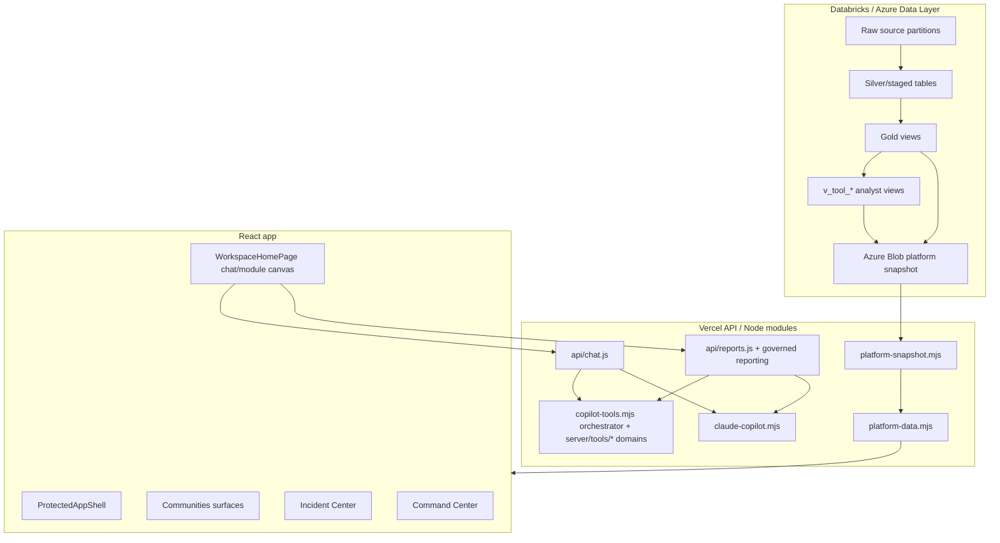

# Platform Architecture

- purpose: explain current Alamo Platform architecture and boundaries
- status: authoritative current-state reference
- owners: engineering, data platform
- updated: 2026-07-22
- tags: architecture, react, vercel, databricks, snapshot, azure
- labels: platform-handbook, current-state
- related files:
  - [alamo-platform-app/src/app/App.tsx](/Users/eric/CareEngineMain/alamo-platform-app/src/app/App.tsx)
  - [alamo-platform-app/src/shared/layout/ProtectedAppShell.tsx](/Users/eric/CareEngineMain/alamo-platform-app/src/shared/layout/ProtectedAppShell.tsx)
  - [alamo-platform-app/server/platform-data.mjs](/Users/eric/CareEngineMain/alamo-platform-app/server/platform-data.mjs)
  - [alamo-platform-app/server/platform-snapshot.mjs](/Users/eric/CareEngineMain/alamo-platform-app/server/platform-snapshot.mjs)
  - [alamo-platform-app/server/qa-artifacts.mjs](/Users/eric/CareEngineMain/alamo-platform-app/server/qa-artifacts.mjs)
  - [alamo-platform-app/src/features/home/hooks/useChatRequestLifecycle.ts](/Users/eric/CareEngineMain/alamo-platform-app/src/features/home/hooks/useChatRequestLifecycle.ts)
  - [alamo-platform-app/vercel.json](/Users/eric/CareEngineMain/alamo-platform-app/vercel.json)

## Purpose

Give future agents and engineers a factual map of what is live now, not what an
older spec intended to build.

## System Boundaries

## Frontend Architecture

The app is a Vite/React 19 single page app.

Primary app entry:

- [App.tsx](/Users/eric/CareEngineMain/alamo-platform-app/src/app/App.tsx)

Current protected routes:

- `/home`: signed-in California community map and comprehensive community-profile entrypoint.
- `/questions`: guided-question workspace, answer timeline, and surfaced modules.
- `/data-architecture`: URL-only, print-ready infographic of the governed data
  path, current depth, integrating referral/profile inputs, and outcome-data gaps.
- `/communities`: portfolio community overview.
- `/communities/:facilityId`: focused community detail.
- `/incidents`: Incident Center.
- `/explorer/:kind`: full-screen governed incident, census, or resident data.
- `/glossary`: definitions and metric support.
- `/command-center`: platform health, analyst QA, intent compiler workbench.

Unknown paths redirect to `/home`; retired product routes are not maintained as separate aliases.

## Shell

[ProtectedAppShell.tsx](/Users/eric/CareEngineMain/alamo-platform-app/src/shared/layout/ProtectedAppShell.tsx)
is the live shell. It:

- requires Microsoft Entra auth before rendering protected routes
- shows the fixed Alamo logo/home control
- collapses brand text while chat/module flow is active
- prefetches heavy workspace modules during idle time
- renders the warm canvas background and current route outlet

Retired sidebar/header prototypes were removed. Do not recreate a second shell;
extend `ProtectedAppShell.tsx` only when a product requirement needs global
navigation.

## API Architecture

Vercel rewrites route nested API paths to handler files:

- `/api/platform/*` -> [api/platform.js](/Users/eric/CareEngineMain/alamo-platform-app/api/platform.js)
- `/api/integrations/pipeline/clinical/*` -> [api/platform.js](/Users/eric/CareEngineMain/alamo-platform-app/api/platform.js), isolated by [server/pipeline-clinical-api.mjs](/Users/eric/CareEngineMain/alamo-platform-app/server/pipeline-clinical-api.mjs)
- `/api/communities/*` -> [api/communities.js](/Users/eric/CareEngineMain/alamo-platform-app/api/communities.js)
- `/api/chat/*` -> [api/chat.js](/Users/eric/CareEngineMain/alamo-platform-app/api/chat.js)
- `/api/reports/*` -> [api/reports.js](/Users/eric/CareEngineMain/alamo-platform-app/api/reports.js)
- all non-API paths -> `index.html`

Core API contracts:

- `GET /api/platform/bootstrap`
- `GET /api/platform/health`
- `GET /api/platform/analyst-qa`
- `GET /api/platform/analyst-traces`
- `GET /api/platform/snapshot-health`
- `GET /api/platform/snapshot-metadata`
- `GET /api/communities/dashboard`
- `GET /api/communities/snapshot?facilityId=...`
- `GET /api/home-dashboard`
- `GET /api/incidents`
- `GET /api/analytics-summary`
- `POST /api/chat/claude/message`
- `GET /api/chat/claude/health`
- `POST /api/chat/tools`
- `POST /api/chat/intent`
- `POST /api/chat/session/reset`
- `GET /api/reports/status`
- `POST /api/reports/create`
- `POST /api/reports/email`
- `GET /api/reports/full/definitions`
- `POST /api/reports/full/create`
- `POST /api/reports/weekly/preview`
- `GET /api/reports/weekly` with Vercel `CRON_SECRET`

Every production and preview contract above, including health endpoints,
requires a delegated Entra access token with the configured `access_as_user`
scope. Authentication runs before route dispatch; request parsing and domain
execution never run for an anonymous request.

The removed legacy assistant compatibility endpoints are not part of the API contract.
Deterministic tools own data access; Claude is the bounded synthesis path.
Governed reports accept only completed registered-question evidence. The
interactive and scheduled paths share the same source validator, report
compiler, HTML renderer, and optional server-side synthesis boundary.
Long-form operating reports use the parallel `governed-full-report-v1`
contract. `server/full-reporting.mjs` freezes the current snapshot inputs,
calculates every displayed value deterministically, attaches named evidence
slices, and emits both a renderer-neutral document and a self-contained
print-ready HTML artifact. Claude is not required to compile a full report and
cannot select, calculate, or alter its evidence.

## Analyst Server Boundaries

`copilot-tools.mjs` is the orchestration layer, not the home for domain logic.
Domain modules under `server/tools/` own incidents, census, residents,
medications, trends, availability, surfaces, data access, query routing,
formatting, execution planning, result safety, certified-answer enforcement,
and result finalization. Local QA artifact parsing and status reporting belong
to `server/qa-artifacts.mjs`, not the warehouse-facing platform data module.
Incident, census, and resident explorer row projection belongs to
`server/data-explorer.mjs`; `server/platform-data.mjs` only loads the required
snapshot and supplies its freshness status.
Snapshot freshness, diagnostics, publish safety, and controlled unavailable
errors belong to `server/snapshot-status.mjs`.
The Databricks SQL client is constructed lazily in `server/databricks.mjs` so
compiler-only and static QA processes do not create warehouse SDK handles.
Medication summary and comparison logic belongs to
`server/tools/medication-summaries.mjs`; exception-detail and medication tool
registration belong to `server/tools/medications.mjs`. The orchestrator only
wires their dependencies and registers the validated definition list.
Portfolio context catalogs, community profiles, operating snapshots, and
community comparisons belong to `server/tools/platform-overview.mjs` and are
registered through one validated platform-overview definition list.
`check:code-health`
enforces these boundaries, a 2,300-line orchestrator budget, import-cycle checks,
and browser-source reachability from `src/main.tsx`.

The workspace page owns composition and rendering. Request cancellation,
latest-request-wins behavior, slow-request timing, inbound prompt timers, and
unmount cleanup belong to `useChatRequestLifecycle.ts`. This keeps thread and
account transitions from depending on page-local timer bookkeeping.
The workspace does not expose a history menu. Its bounded background
conversation journal remains isolated in `chatHistory.ts`, while reload and New
Chat always begin with a clean visible workspace. Module routes, labels, icons,
and tool-result message projection belong to `workspaceModuleModel.ts`, leaving
the page responsible for conversation orchestration rather than low-level models.

## Shared Runtime Boundaries

Cross-cutting behavior has one owner:

- [period-utils.mjs](/Users/eric/CareEngineMain/alamo-platform-app/shared/period-utils.mjs)
  owns month parsing, range expansion, display labels, and closest-valid-period
  recovery.
- [community-names.mjs](/Users/eric/CareEngineMain/alamo-platform-app/shared/community-names.mjs)
  owns legacy community-name normalization for deterministic and synthesized
  results.
- [http-errors.mjs](/Users/eric/CareEngineMain/alamo-platform-app/server/http-errors.mjs)
  owns API request URL parsing and controlled JSON error responses, including
  snapshot-unavailable `503` behavior.
- [browserDownload.ts](/Users/eric/CareEngineMain/alamo-platform-app/src/shared/files/browserDownload.ts)
  owns browser text-file downloads.
- [multiSeriesData.ts](/Users/eric/CareEngineMain/alamo-platform-app/src/shared/charts/multiSeriesData.ts)
  owns multi-series sanitization used by trend and heatmap modules.
- [counts.ts](/Users/eric/CareEngineMain/alamo-platform-app/src/shared/data/counts.ts)
  owns top-frequency aggregation used by community surfaces.

Do not recreate local versions of these algorithms. `check:code-health`,
`check:unused`, and `check:duplicates` enforce the boundary and keep stale or
copied implementations from accumulating.

## Snapshot-First Data Rule

Snapshot-backed API methods call
[platform-data.mjs](/Users/eric/CareEngineMain/alamo-platform-app/server/platform-data.mjs),
which requires a published snapshot for core bootstrap/dashboard/community
surfaces. If the snapshot is missing, the API returns a controlled `503`
instead of silently rebuilding a page from live fan-out Databricks reads.

Snapshot storage behavior:

- Azure Blob is required in production and read failures stop safely rather than serving a stale local file.
- Local development fallback is `alamo-platform-app/generated/platform-snapshot/latest.json`.
- Expected Azure paths are `snapshots/daily/latest.json` and
  `snapshots/daily/YYYY-MM-DD.json`.

## Live Incident Exception

`GET /api/incidents` is deliberately different. It disables browser/CDN caching
and tries live Databricks first because Incident Center is an operational feed.
If live Databricks fails, it falls back to the published snapshot and includes a
warning.

## Auth And Identity

Frontend auth:

- Microsoft Entra via MSAL.
- Required browser-safe vars: `VITE_ENTRA_CLIENT_ID`, `VITE_ENTRA_TENANT_ID`.
- The browser derives its Entra callback from the current origin as `/login`; cross-origin redirect overrides are not supported.
- MSAL cache is session storage.
- Production browser requests acquire a delegated `access_as_user` token and attach it to every `/api` request.

User API authorization:

- Every Vercel API handler calls the shared `server/api-auth.mjs` boundary.
- Production and Vercel previews fail closed by default.
- The server verifies the Entra signature, tenant issuer, API audience, and delegated scope before reading platform data.
- The deployment can additionally require an Entra app role through `ENTRA_API_REQUIRED_ROLE`.
- Local development bypass is allowed only when `API_AUTH_REQUIRED` is false or unset outside Vercel preview/production.

Profile behavior:

- First sign-in creates a lightweight local app profile from Entra token claims.
- Stored profile key is per `homeAccountId`.
- Profile stores display name, first/last name, email, role label, initials, and
  default notification settings.

Server/service auth:

- Azure Blob uses Entra service principal or optional connection string.
- Databricks uses OAuth client credentials in production.
- PAT fallback exists only when explicitly allowed in development.

## Data Privacy Boundary

The server strips large historical incident detail and bounded MAR exception
detail before sending general summary payloads to the browser when those
rows are not needed. AH Analyst tools can use bounded tool-context rows through
server-side logic. Future docs should keep this distinction clear.
