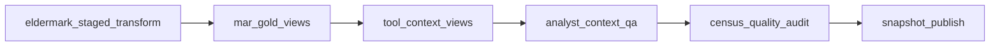
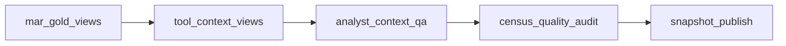

# Data Publishing And Snapshot Pipeline

- purpose: explain the Databricks-to-snapshot publish path that feeds the platform
- status: authoritative current-state reference
- owners: data platform, engineering
- updated: 2026-07-18
- tags: databricks, snapshot, azure, gold, analyst-qa, publish
- labels: platform-handbook, current-state
- related files:
  - [alamo-platform-app/databricks/workflows/daily_platform_publish.json](/Users/eric/CareEngineMain/alamo-platform-app/databricks/workflows/daily_platform_publish.json)
  - [alamo-platform-app/databricks/workflows/daily_snapshot_refresh.json](/Users/eric/CareEngineMain/alamo-platform-app/databricks/workflows/daily_snapshot_refresh.json)
  - [alamo-platform-app/databricks/notebooks/tool_context_views.py](/Users/eric/CareEngineMain/alamo-platform-app/databricks/notebooks/tool_context_views.py)
  - [alamo-platform-app/databricks/notebooks/analyst_context_qa.py](/Users/eric/CareEngineMain/alamo-platform-app/databricks/notebooks/analyst_context_qa.py)
  - [alamo-platform-app/databricks/notebooks/census_quality_audit.py](/Users/eric/CareEngineMain/alamo-platform-app/databricks/notebooks/census_quality_audit.py)
  - [alamo-platform-app/databricks/notebooks/snapshot_publish.py](/Users/eric/CareEngineMain/alamo-platform-app/databricks/notebooks/snapshot_publish.py)
  - [alamo-platform-app/databricks/notebooks/overview_report_extract.py](/Users/eric/CareEngineMain/alamo-platform-app/databricks/notebooks/overview_report_extract.py)
  - [platform-daily-publish-runbook.md](/Users/eric/CareEngineMain/alamo-platform-app/docs/reference/platform-daily-publish-runbook.md)

## Scope

This document covers platform publishing. MAR appears here only as a source of
medication analytics rows that may feed platform modules and AH Analyst.

## Full Daily Publish Workflow

Workflow file:

- [daily_platform_publish.json](/Users/eric/CareEngineMain/alamo-platform-app/databricks/workflows/daily_platform_publish.json)

Current task order:



Task purpose:

- `eldermark_staged_transform`: normalize raw landed source partition into stable silver datasets, mark countable residents, and build full-history monthly census.
- `mar_gold_views`: build governed medication/MAR gold views used as platform data feeds.
- `tool_context_views`: create analyst-ready `v_tool_*` views anchored to the explicit publish `date_partition` when provided.
- `analyst_context_qa`: block snapshot publication on critical data-contract failures.
- `census_quality_audit`: prove census/countability, weekly coverage, and suspect resident exclusions before publishing.
- `snapshot_publish`: publish app-ready snapshot JSON to Azure Blob.

The daily pipeline has one product output: the governed platform snapshot.
Narrative report and briefing generation are intentionally not part of this
workflow; AH Analyst synthesizes only after deterministic tool evidence is
available.

Long-form reports do not require another Databricks output. The application
compiler freezes and assembles the already-published governed snapshot into a
versioned report document. Databricks remains responsible for the accuracy,
coverage, and freshness of the underlying census, incident, resident, and MAR
slices.

## Governed Report Extract

Notebook:

- [overview_report_extract.py](/Users/eric/CareEngineMain/alamo-platform-app/databricks/notebooks/overview_report_extract.py)

Use this read-only notebook when an analyst needs chart-ready report datasets
directly from the governed gold views. It covers coverage, quarterly operations,
weekly and monthly census and flow, LOS, discharge outcomes, internal
readmissions, incidents, medication execution, current resident mix, services,
assessments, notes, unit placement, and data-quality evidence.

After all datasets render, the notebook writes one Excel workbook to
`Workspace > Home > alamo-platform-exports`. Each governed result has its own
worksheet with ordinary columns and values. If the runtime lacks the Excel
writer, the notebook writes one ZIP of CSV files to the same Workspace folder.
This avoids the notebook table-result limit of 10,000 rows or 2 MB without using
DBFS FileStore or requiring a Unity Catalog Volume.

The notebook is not a daily workflow task. Running it does not replace, refresh,
or publish any platform view or snapshot. Its provisional discharge-outcome
mapping requires business-owner review before a successful-discharge percentage
is published. It also keeps licensed-bed occupancy, external readmission, and
county/IMD/jail cost outside the computed metrics until those source contracts
exist.

## Short Snapshot Refresh Workflow

Workflow file:

- [daily_snapshot_refresh.json](/Users/eric/CareEngineMain/alamo-platform-app/databricks/workflows/daily_snapshot_refresh.json)

Task order:



Use this when upstream gold data already exists and the goal is to refresh the
platform snapshot/tool context.

Pass the same explicit `date_partition=<business-date-YYYY-MM-DD>` into
`mar_gold_views`, `tool_context_views`, `analyst_context_qa`,
`census_quality_audit`, and `snapshot_publish`. Even a snapshot-only refresh
should be anchored to the intended business date instead of the notebook run
time.

## Published Snapshot Contract

Notebook:

- [snapshot_publish.py](/Users/eric/CareEngineMain/alamo-platform-app/databricks/notebooks/snapshot_publish.py)

Writes:

- `snapshots/daily/latest.json`
- `snapshots/daily/YYYY-MM-DD.json`

Default storage:

- account: `alamodatalake`
- container: `alamo-platform-snapshots`
- root: `snapshots/daily`

Core snapshot sections:

- `snapshot`: metadata, version, generated timestamp, and governed `as_of_date`
- `communitiesDashboard`: communities, governed resident profiles, incident rollups, census
- `reportsSummary`: internal analytics-support slices plus `toolContext`
- analyst context manifest and tables under `reportsSummary.toolContext`
- `clientDatabase`: a lightweight pointer to the separately published static client database

The optional `clientDatabase.path` points to a QA-approved JSON object in the
same protected Azure container. The application validates that object against
its published client count, baseline date, unique `canonical_client_id` primary
key, dataset version, and complete source column list before serving it. It is not copied into the general
platform bootstrap: the server loads it only for resident/client search, caches
one validated copy per pointer identity, and joins it to `resident_profile` and
`resident_episode_history` only on `canonical_client_id`. Current resident rows
without a canonical match remain visible and are marked unmatched; the runtime
does not infer links from names or resident numbers.

The protected client directory response contains searchable identity aliases and
summary fields but not all client records in bulk. Selecting one client requests
that client's complete 141-field record, current resident profile, and governed
episode history. This keeps the directory response bounded while the server
continues to reuse the same validated static client-database index.

The client database may add an optional `documents` manifest without changing
the frozen August 18 client rows or columns. Every manifest row must reference
an existing `canonical_client_id`, use a unique client/document pair, and carry
only approved PDF/image metadata plus private asset paths under
`snapshots/client-documents`. The application validates those paths against a
fixed allowlist and never returns them to Pipeline. The initial additive
publication contains re-encoded first-page PNG thumbnails only; the dated
August 18 baseline blob and the original source files are not overwritten.

Incident narratives are serialized once under
`reportsSummary.toolContext.tables.incident_detail_history`. Community
drilldowns hydrate their facility-specific incident rows from that canonical
collection. `communities.incidentDetails` and prebuilt community snapshots do
not duplicate those narratives, preserving the full published detail window
without exceeding the 64 MB snapshot transport contract.

Weekly census and resident-flow transport tables are bounded to the governed
52-month operating-history window using `snapshot.as_of_date`. Monthly census
and resident-flow tables retain the complete available company history. This
prevents malformed pre-Alamo dates from expanding each weekly table back to
1964 while preserving every meaningful operating week and all long-range
monthly analysis.

Visible resident counts, resident search, community active roster counts, and
incident resident names must come from the governed resident profile
(`v_tool_resident_profile`). Raw `v_active_residents` and raw `v_occupancy`
are audit/source inputs only; they should not drive user-facing census totals.

`generated_at` records when the JSON was produced. It must never be used as the
data period. `snapshot.as_of_date` and `communities.as_of_date` both carry the
same explicit business date from `date_partition`. Live Databricks fallback
queries derive the equivalent date from governed census and fence incident
rows on both sides of that date. Answer formatting may say “month to date” only
when the reported month matches this as-of month and that calendar month is not
complete.

The platform reporting day is fixed to California time
(`America/Los_Angeles`) in shared code. Server tools, browser freshness views,
and generated QA use that same reporting-day contract; it is not an environment
setting that can drift between runtimes. Date keys remain ISO internally. Every
full product date renders as `1 February 2026`, every month-only period renders
as `February 2026`, and raw ElderMark bang dates or ISO timestamps never render
as user-facing copy.

The certified-answer cache signature includes this California reporting date in
addition to the governed data rows. Cached rolling 30-, 90-, and 180-day metrics
therefore expire at the reporting-day boundary even when no new snapshot has
arrived. A stale cache safely becomes a live deterministic calculation instead
of returning yesterday's recency counts.

New local or Azure snapshot writes are rejected unless both governed as-of
fields are present and equal. Readers still accept older snapshots without the
fields during migration, but the dated Azure object key for every new publish
comes from `snapshot.as_of_date`, never from the generation clock.

Silver Parquet publication is rollback-protected. The transform validates the
staged dataset, moves the prior stable dataset to a partition-scoped rollback
path, validates the promoted files, then registers and reads the silver table
before deleting the rollback copy. Failed promotion, registration, or readback
restores the prior stable files and metastore table. An interrupted run with a
retained rollback directory is recovered before a later publish is allowed to
continue.

## Analyst Tool Context

Notebook:

- [tool_context_views.py](/Users/eric/CareEngineMain/alamo-platform-app/databricks/notebooks/tool_context_views.py)

It creates additive gold views for AH Analyst and modules. Important families:

- community operating summary
- incident monthly by community/category
- current-month incident detail
- historical incident detail
- census monthly by community
- census weekly by community
- census data quality and resident countability audit
- resident profile and resident incident summary
- resident admission/discharge episode history
- weekly and monthly intake/discharge flow by community
- documentation status
- medication compliance/refusal summaries
- monthly medication administrations and outcomes
- current medication orders
- complete governed exception and PRN rows inside their bounded 90-day windows

`tool_context_views` owns the `v_incidents` and `v_mar` source adapters plus the
`v_tool_*` analytics views. After the staged transform replaces silver tables,
it rebinds an existing retained gold definition only when Spark reports a stale
cached schema. It does not alter silver tables or invent replacement business
logic; a genuinely missing or still-invalid dependency fails with its view name.
- tool context manifest

The manifest lets the app explain what is loaded before it answers.

### Weekly Analysis Contract

Weekly analysis is anchored to the governed source `date_partition`, not the
notebook run time or snapshot upload time. Census change means census on that
business date minus census exactly seven calendar days earlier. A partial
calendar week therefore still has a true seven-day comparison; it is never
compared with the prior Sunday and mislabeled as a weekly change.

Weekly intake and discharge views rebuild from resident episode dates and emit
an explicit zero row for every quiet facility/week. Irregular pipeline runs do
not create artificial gaps because the series is reconstructed from source
events through the governed as-of date. If no newer source partition has
landed, the as-of date and weekly analysis do not advance. Late source
corrections become visible when the affected partition is transformed and the
views and snapshot are republished.

The zero-filled weekly calendar begins with the first governed census month.
Older resident episode dates remain available in monthly episode history, but
they cannot expand weekly operational tables before governed census coverage.
This prevents malformed legacy dates from creating decades of meaningless
zero rows.

`analyst_context_qa`, `census_quality_audit`, and `snapshot_publish` all reject
weekly census rows whose dates are not exactly seven days apart or whose
arithmetic does not reconcile. The application also rejects malformed weekly
comparisons. During migration from an older snapshot contract, it may rebuild
the exact seven-day-prior census from governed resident episode history using
the same active-resident rule as the weekly view. It never substitutes the
previous available row or labels a shorter interval as a weekly change.

## Data QA Gate

Notebook:

- [analyst_context_qa.py](/Users/eric/CareEngineMain/alamo-platform-app/databricks/notebooks/analyst_context_qa.py)

Critical checks include:

- manifest exists
- resident profile exists
- census history exists
- weekly census history exists
- census data-quality and resident countability audit rows exist
- incident monthly and current detail exist
- historical incident detail reconciles to monthly aggregate
- enriched resident profiles match resident rows
- resident incident rollups reconcile to incident detail
- medication/MAR data IDs and summaries reconcile where enabled
- current medication orders and PRN-effectiveness detail reconcile to their manifest counts
- incident detail latest month reconciles to aggregate

Warnings include:

- MAR exception detail availability
- current-order and PRN-detail availability
- unknown medication outcomes threshold
- medication freshness
- latest census community coverage
- census history coverage against resident episodes
- incident freshness

## Census Correctness

Monthly census must be rebuilt upstream when census logic changes. Re-running
only `snapshot_publish` can produce a fresh snapshot timestamp while preserving
old or wrong census rows.

Current census rules:

- count distinct resident numbers, not raw resident rows
- parse ElderMark bang dates only as `day!month!four-digit-year`; malformed, impossible, or century-ambiguous values become null instead of being reinterpreted
- exclude residents marked non-countable by the silver transform
- exclude obvious test, fake, dummy, sample, training, demo, placeholder, or invalid rows
- fail the census quality gate when countable admit dates precede `minimum_reasonable_admit_date`, because those rows can make “full history” start decades too early
- count a resident for a month only if admitted on or before month end and not discharged before or on month end
- include residents on temporary leave while they remain admitted and have not been discharged; leave status is informational and never subtracts from census
- match informational leave status on both `Facility` and `Res_Number`, with the same rule for all five communities and no San Pablo-specific offset or exception
- build 52 months of census history by default; use `census_history_months=0` only for deliberate full-history rebuilds
- use `eldermark_census_rebuild` only as a recovery path after the 32 silver source tables have already completed successfully
- use `v_tool_resident_profile` for current visible resident counts after the countability audit has run

The important distinction: raw source tables can be useful for finding bad
data, but the platform should answer from governed rows. If raw active or raw
occupancy counts differ from governed counts, treat that as a data-quality
finding, not as the number to show users.

When census looks wrong, run this sequence:

1. `eldermark_staged_transform` with `census_history_months=52` for the routine operating window, or `0` only when intentionally rebuilding all available history.
2. `mar_gold_views` with the same `date_partition` and the configured `governed_start_date` if MAR/medication views need to be refreshed.
3. `tool_context_views` with the same `date_partition` used by the transform.
4. `analyst_context_qa` with the same `date_partition`.
5. `census_quality_audit`.
6. `snapshot_publish`.

If the source-table section completed but the run was canceled or stuck during
`Census_Snapshot`, import and run `eldermark_census_rebuild` with the same
`date_partition`. This skips raw source table processing and rebuilds only the
governed 52-month census snapshot from the already-published resident silver
table. The recovery notebook writes census first; `census_quality_audit` remains
the validation gate after the tool-context views are refreshed.

Paste the `census_quality_audit` outputs for:

- source and gold row counts
- latest census vs raw and governed active roster
- suspected fake/test/non-countable resident rows
- non-countable rows that reached governed resident profile
- duplicate active resident rows
- transform partition vs governed census month
- gold census vs recalculated silver resident month-end census
- weekly census coverage from resident episodes
- countable resident rows before the configured historical floor
- the final `CENSUS_QUALITY_SUMMARY=...` line

`CENSUS_QUALITY_SUMMARY.ok` must be `true`. The notebook raises before
snapshot publication if critical checks fail, including non-countable rows in
governed resident profile, duplicate countable active resident keys, gold
census rows that do not match recalculated silver month-end census, or missing
weekly census coverage. It also fails if the latest governed census month
extends beyond the silver resident or census transform partition month.

Do not publish the snapshot if the audit shows unexplained census differences.

After `analyst_context_qa`, paste the final `ANALYST_CONTEXT_COUNTS=...`
line if any census, resident-flow, or countability slice still looks missing
in the app.

After `snapshot_publish`, confirm the `payload_audit` has non-zero values for:

- `incident_monthly_rows`
- `medication_compliance_rows`
- `census_weekly_rows`
- `census_quality_rows`
- `resident_countability_rows`
- `resident_flow_monthly_rows`

Also check `payload_headroom_bytes`. The publisher keeps one canonical
incident-detail collection and hydrates selected community snapshots from it,
rather than serializing the same narratives once per community. If the 64 MiB
contract is exceeded, the error includes top-level sizes and the ten largest
tool-context tables so the owning slice is visible immediately.

For a normal five-community publish, the two weekly tables should contain only
the governed 52-month window, not roughly 16,000 rows each. If either weekly
table begins before the operating-history window, replace and rerun the current
`snapshot_publish.py`; do not raise the 64 MiB contract or discard MAR detail.

Also confirm the historical range fields look right:

- `incident_monthly_min_month`
- `medication_compliance_min_month`
- `resident_episode_min_date`
- `resident_flow_monthly_min_month`
- `census_weekly_min_week`

If any of those are zero, do not troubleshoot the frontend. The snapshot does
not contain the historical census/context tables the analyst needs.

## Runtime Snapshot Diagnostics

[platform-data.mjs](/Users/eric/CareEngineMain/alamo-platform-app/server/platform-data.mjs)
derives diagnostics such as:

- snapshot size and configured maximum
- source: Azure storage or local fallback
- generated timestamp and age
- stale flag against `PLATFORM_SNAPSHOT_MAX_AGE_HOURS`
- tool context version, manifest count, table count
- incident detail row count
- weekly census, census quality, resident countability, and monthly resident-flow row counts
- MAR monthly/resident/exception row counts
- `censusTrustReady` boolean
- `marReady` boolean

Command Center renders these diagnostics.

After Databricks publishes the governed snapshot, verify the app reads the
Azure snapshot with:

```bash
cd /Users/eric/CareEngineMain/alamo-platform-app
npm run check:mar-analytics:azure
```

This is intentionally separate from the normal local MAR check. Local
development prefers `generated/platform-snapshot/latest.json` by default;
production and the Azure validation command read `snapshots/daily/latest.json`.

## Important Failure Modes

- Wrong `date_partition` can publish a believable but wrong day.
- Running `snapshot_publish` before `tool_context_views` leaves analyst context empty.
- Running `snapshot_publish` before `analyst_context_qa` can publish contract-breaking data.
- Publishing a locally generated app snapshot to Azure can overwrite the
  Databricks governed snapshot with fresh metadata but empty `toolContext`.
  The normal app build does not publish snapshots; use Databricks
  `snapshot_publish` for production snapshot updates. App-side Azure snapshot
  publishing is blocked when `toolContext` is empty unless an emergency override
  is set with `PLATFORM_SNAPSHOT_ALLOW_EMPTY_TOOL_CONTEXT=true`.
- Local generated snapshots can be stale even when Azure published snapshots are current.
- Incident Center may show fewer current-day incidents if upstream source data has not landed,
  even when the snapshot itself was generated today.

## Operator Rule

If the app says tool context has zero manifest rows or zero tool tables, rerun:

1. `tool_context_views`
2. `analyst_context_qa`
3. `census_quality_audit`
4. `snapshot_publish`

Use the same explicit `date_partition` for the rerun.

Do not solve that symptom by changing frontend code.

Also confirm nothing has run `npm run snapshot:publish` or set
`PLATFORM_SNAPSHOT_PUBLISH_AZURE=true` outside the Databricks publish path.
