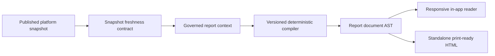

# Full Reporting

- purpose: canonical contract for governed long-form reports
- status: authoritative current-state reporting guide
- owners: product, engineering, data platform
- updated: 2026-08-05
- tags: reports, governance, artifacts, evidence
- labels: platform-handbook, current-state, authoritative

## Product Contract

Full reports are deterministic operating documents compiled from the current
published platform snapshot. They are not frozen extracts, free-text drafts, or
client-assembled combinations of partial data. The report compiler owns scope,
period, calculations, narrative, visual blocks, evidence, and the downloadable
artifact.

Every report must:

- answer its operating question in the opening paragraph;
- use governed census rather than resident-profile row counts;
- preserve community and period scope through every section;
- use only consecutive months with the same reporting-community set in portfolio trend lines;
- exclude staff, test, vacancy, and other operational placeholder profiles;
- distinguish unavailable data from zero;
- disclose resident-flow community coverage before presenting aggregated admissions, discharges, or net movement;
- omit columns and sections that have no usable values;
- aggregate repeated source rows before presenting community comparisons;
- keep named resident worklists out of portfolio-level population reports;
- avoid repeating a focused report inside the portfolio overview;
- expose only periods covered by its required source slices;
- show the snapshot update time and a visible stale-data warning when needed;
- render in the app, at mobile width, and as a standalone printable artifact;
- retain source row counts in a collapsed evidence section.

## Report Library

The governed service retains seven report definitions. Analytics navigation
shows only the five finished report families. The community performance report
remains callable for compatibility, but it is hidden because the focused reports
already support community scope. The effectiveness evidence report is also hidden
until its external outcome, referral, and utilization evidence is complete enough
for release.

| Report | Scope | Period rule | Purpose |
| --- | --- | --- | --- |
| Portfolio overview | Portfolio | Latest or census/incident/medication overlap | A concise cross-community operating comparison across census, current capacity, incidents, medication completion, resident flow when loaded, and current aggregate resident context |
| Community performance report | One community | Census/incident/medication overlap | One community in full, including census, admissions and discharges, resident profile, incidents, medication performance, documentation coverage, capacity, and watch items |
| Effectiveness evidence report (hidden until complete) | Portfolio or community, tailored to one supported audience | Latest or census/incident/medication overlap | In-development evidence case retained outside navigation until required external outcomes are governed and complete |
| Census and resident flow | Portfolio or community | Every loaded census month | Selected-month census, a recent 12-month trend, full-history annual census context, and monthly and annual resident flow when loaded |
| Incident report | Portfolio or community | Every loaded incident month | Historical incident trend, category concentration, one aggregated row per community, and severity indicators only when detail reconciles to the aggregate |
| Medication performance report | Portfolio or community | Every loaded medication month | A weighted monthly completion trend, one selected-month community table, period-aligned refusals, and current resident medication burden when complete |
| Resident population | Portfolio or community | Current state only | Current profile coverage, source diagnosis labels, age, aggregate length-of-stay measures when complete, and community comparisons with governed census kept separate from profile counts |

Do not add a second portfolio summary, a fixed-date alias, or a one-off report
page. Expand one of these reports when its purpose already covers the requested
analysis. Add a new family only when it has a distinct audience, source
contract, and operating decision.

The 50-state targeting atlas remains available at `/fiftystate`, but it is not
part of Analytics report navigation.

## Runtime Flow



Primary implementation:

- `shared/full-report.mjs`: seven-report registry, request and document validation,
  and the single responsive/print HTML renderer;
- `shared/effectiveness-evidence.mjs`: shared audience and evidence-plan registry
  used by the effectiveness report and 50-state atlas;
- `server/full-reporting.mjs`: governed calculations, period discovery, and
  report compilation;
- `api/reports.js` and `server/dev-api.mjs`: authenticated report endpoints;
- `src/features/reports/pages/ReportsPage.tsx`: server-driven Analytics catalog
  and scope controls;
- `src/features/reports/components/FullReportReader.tsx`: responsive document
  reader.

The UI fetches the report definitions from the server. It does not maintain a
second report catalog.

## Currentness

Reports update automatically after a successful snapshot publish. They do not
become current merely because the app was redeployed or a report was reopened.
The daily data path remains:

1. verify raw landing;
2. run the staged transform;
3. rebuild tool-context views;
4. run analyst context QA;
5. run census quality audit;
6. publish the platform snapshot.

The report header displays the snapshot's actual generated time. When the
snapshot exceeds the freshness target, both the in-app reader and standalone
artifact display the delay warning while continuing to identify the data that
was used.

Current capacity and operating limits are point-in-time reference data. They
appear only on latest reports and must never be backfilled into historical
periods. Medication completion is weighted from scheduled and given counts.
Medication refusal concentration is aligned to the selected report month.
Portfolio census, incident, and medication trend lines use the latest contiguous
months with an identical reporting-community set. The census annual table keeps
all loaded history, identifies community coverage, and marks first-to-last
changes as not comparable when that set changed.
Resident-flow totals are labeled as reported totals whenever the selected month
does not contain every census community. Missing community flow rows remain not
reported rather than being converted to zero. Annual flow tables identify the
number of communities represented and do not imply complete community-month
coverage. The annual table uses the latest contiguous run of years so isolated
legacy events do not appear as part of a continuous operating trend.

Current resident-profile, documentation, medication-burden, and weekly census
measures appear only on current-state reports whose purpose requires them. The
portfolio overview uses aggregate resident context and never reproduces named
resident watchlists. A documentation coverage rate is shown only when every
governed resident profile in scope has a matching status row. Resident medication
burden likewise requires a matching MAR summary row for every governed resident
profile in scope. Incident severity appears only when selected-period detail rows reconcile
exactly to the governed aggregate and contain all severity flags. Internal
30-, 90-, and 180-day readmission rates use only discharges whose full follow-up
window has elapsed and detect only a later admission inside Alamo. Missing or
partial inputs cause these sections or measures to be omitted, never converted
to zero.

## Verification

Run:

```bash
npm run check:full-reports
npm run check:reports
npm run check:browser-full-reports
```

The default browser check may use the local fallback snapshot. It proves layout
and behavior, not production freshness. To audit the currently published data,
force the Azure snapshot explicitly:

```bash
PLATFORM_SNAPSHOT_READ_SOURCE=azure npm run check:browser-full-reports
```

The deterministic check compiles all seven service reports across current,
historical, community, audience, and stale-snapshot scenarios. It also verifies
aggregation, omission of unsupported measures, period boundaries, and the
absence of named resident worklists in portfolio reports. The browser check
opens all five published Analytics reports, verifies required and forbidden
sections, rejects table/header mismatches and all-empty columns, captures every
report at desktop and mobile widths, and confirms responsive containment.

The effectiveness report may describe only evidence observed in the governed
snapshot. Internal repeat episodes and readmission rates are labeled as internal
Alamo measures, not external hospital readmission or recidivism. Prior hospital
or jail utilization, complete lower-
level-of-care outcomes, external readmissions, standardized assessment change,
and cost avoidance remain named data gaps until governed sources are loaded.

## Data Expansion

The next valuable additions are historical operating-limit changes, complete
admission and discharge destinations, deeper incident history, pre-admission
acute utilization, external readmissions, repeated standardized assessments,
approved cost benchmarks, and approved delivery identity for scheduled
distribution. New data should extend the existing seven reports instead of
creating overlapping report names.
