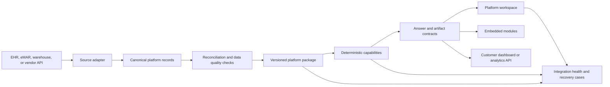

# Integration Platform Strategy

- purpose: define how Alamo Platform can become a reusable analytics and operating layer for EHR, eMAR, and dashboard products
- status: approved platform direction; current capabilities and required productization work are identified separately
- owners: product, engineering, data platform, security
- updated: 2026-07-18
- tags: integration, ehr, emar, analytics, embedding, recovery, platform
- labels: platform-handbook, platform-direction, integration-contract
- related files:
  - [architecture.md](/Users/eric/CareEngineMain/alamo-platform-app/docs/platform/architecture.md)
  - [analyst-system.md](/Users/eric/CareEngineMain/alamo-platform-app/docs/platform/analyst-system.md)
  - [data-publishing.md](/Users/eric/CareEngineMain/alamo-platform-app/docs/platform/data-publishing.md)
  - [testing-quality.md](/Users/eric/CareEngineMain/alamo-platform-app/docs/platform/testing-quality.md)

## Decision

Alamo Platform should become a reusable application layer that can sit on top
of an EHR, eMAR, data warehouse, or existing analytics product.

It should not replace the source system. The source system remains responsible
for clinical records, medication administration, billing, documentation, and
transactional workflows. Alamo Platform should provide a consistent way to:

- map source data into a defined operating model
- publish a bounded and traceable analytics package
- answer approved operational questions from deterministic calculations
- render reusable analytical modules
- export the exact supporting records when permitted
- report data availability and freshness plainly
- detect, contain, diagnose, verify, and retain lessons from failures

The result should be useful as a complete workspace, an embedded analytical
surface, or a backend capability used by another dashboard. These delivery
options are target contracts, not all current production capabilities.

## Current Base

The current Alamo implementation proves the main operating model:

- A snapshot-first publish path separates source-system load from application
  response time.
- Deterministic tools own calculation, filtering, period selection, scope,
  record identity, and truth state.
- The analyst layer explains verified evidence but does not own the data
  contract.
- A certified question catalog routes common questions through repeatable
  capabilities.
- A module registry maps analytical results to reusable visual surfaces.
- Exact detail requests can provide a bounded preview and a full CSV artifact.
- Availability states distinguish valid records, verified zero, unavailable
  detail, stale data, and rejected execution plans.
- Turn-level quality checks inspect intent, data, answer, surface, display, and
  recovery behavior.
- Browser tests replay every guided answer across wide desktop, desktop,
  mobile, and compact layouts.

These are platform assets. They should remain independent of any single source
vendor as the system is productized.

## Admissions Workspace Boundary

Alamo Platform is the authenticated front door and governed clinical-data
owner. Pipeline remains the transactional owner for referral packets,
assessment work, files, corrections, and admission decisions. The two products
must share identity and bounded APIs, not browser state or database tables.

The Alamo `/admissions` route is a governed aggregate dashboard for census and
placement context. It links to, but never embeds, the Pipeline application; it
does not forward record identifiers in a URL or read referral documents into
the Alamo browser. Pipeline continues to obtain census and resident context
through the existing server-only clinical API.

Entra app roles define the browser boundary:

- `Alamo.Admissions.Assessor` can enter Admissions only and cannot preload or
  call broader Alamo analytics APIs.
- `Alamo.Admissions.Supervisor` can enter Admissions and the broader Alamo
  workspace.
- `Alamo.Admissions.Admin` has the supervisor access model and owns role
  administration.

The application role `Pipeline.Clinical.Read.All` remains service-principal
only and does not grant browser access. Role assignments take effect after the
user signs out and signs back in.

The dedicated read-only Pipeline namespace also exposes a bounded canonical
client directory and client detail endpoint. The server loads the static object
referenced by `clientDatabase.path` once per pointer identity, indexes it by
`canonical_client_id`, and joins current resident profiles and episode history
only on that key. Directory search supports name, canonical ID, and resident
number; full enrichment is returned only for one selected client.

Pipeline owns assessment history. For a confirmed existing client it stores the
Alamo `canonical_client_id` with each assessment and never replaces the static
August 18, 2026 baseline. New-client and incremental Databricks writes remain
disabled until a separate payload, QA, rollback, cost, and approval review.

## Current Limitations

The current repository is not yet a drop-in integration product. It contains
working assumptions that are specific to Alamo Health and ElderMark, including:

- source table and field mappings
- community and facility normalization rules
- Microsoft Entra application configuration
- Databricks, Azure Blob, and Vercel deployment choices
- Alamo branding and route structure
- one organization's metric definitions and question catalog
- in-process analyst traces without a durable operations store
- no public, versioned adapter or embedding contract
- no complete tenant isolation model

Those constraints are acceptable for the reference implementation. They must
be extracted behind explicit contracts before another organization can adopt
the platform without modifying core code.

## Target Architecture



The core platform begins at canonical records. Vendor-specific logic belongs
in source adapters. Customer-specific presentation belongs in configuration.
Core calculations, answer contracts, module behavior, and quality gates should
not branch by vendor name.

## Required Contracts

### 1. Organization Contract

Every request, published package, trace, export, and recovery case must carry
an organization identifier. Facility and resident identifiers must be scoped
to that organization. Cross-organization reads must fail closed.

The organization configuration should define:

- organization and facility identifiers
- display names and approved branding
- time zone and reporting calendar
- enabled capabilities
- metric-definition version
- source-adapter version
- identity and role mappings
- data-retention and export policy
- freshness expectations by dataset

### 2. Identity And Authorization Contract

Authentication must be configurable rather than tied to one Entra tenant. The
platform should accept a verified identity from a supported deployment or host
application and resolve it to platform roles and data scopes.

Authorization must be enforced on the server for:

- organization
- facility
- resident detail
- medication detail
- exports
- administrative health and recovery data

Embedding must not rely on hidden UI controls for security. The server must
validate the same scope for direct API calls.

### 3. Source Adapter Contract

A source adapter converts vendor records into canonical platform records. It
owns vendor authentication, extraction, pagination, incremental cursors,
deletions, source identifiers, code mapping, and source-specific error handling.

Each adapter must publish:

- adapter name and semantic version
- source system and source account identifiers
- extraction start and completion timestamps
- source watermark or cursor
- record counts by canonical dataset
- rejected-record counts and reasons
- field-level mapping version
- reconciliation results
- supported and unsupported capabilities

An adapter may be batch, API-based, file-based, or warehouse-based. The output
contract should be the same.

### 4. Canonical Data Contract

The first canonical model should cover the entities already exercised by the
reference implementation:

- organization
- facility
- resident identity and current status
- census observation and resident movement
- incident event and incident category
- medication order or medication identity where available
- medication administration and exception
- documentation status
- source provenance
- dataset availability and freshness

Every canonical record must include stable organization-scoped identity,
source identity, event or effective time, ingestion time, and provenance. Null,
zero, unavailable, and not-supported states must remain distinct.

The contract must be versioned. A breaking field or semantic change requires a
new contract version and adapter conformance run.

### 5. Published Package Contract

The published package is the runtime boundary between data integration and the
application. It should contain:

- contract version
- organization identifier
- generation time and source watermarks
- dataset coverage and freshness
- facility directory
- canonical summary and bounded detail records
- metric-definition versions
- capability availability
- source and adapter provenance
- validation results
- package checksum

Publication must be atomic. A failed or partial package must not replace the
last verified package. The application should be able to use the last verified
package with a clear stale warning when policy permits.

### 6. Metric Contract

Metrics must be portable definitions, not prose conventions. Each definition
should state:

- metric identifier and version
- numerator and denominator
- record grain
- included and excluded statuses
- time basis
- organization and facility scope rules
- zero and unavailable behavior
- required canonical datasets
- display format
- reconciliation tolerance

Customer-specific definitions may override a base definition only through a
versioned configuration that is visible in the glossary and answer evidence.

### 7. Capability Contract

The unit of extension is a complete capability, not a prompt or chart alone.
A capability consists of:

- a stable identifier
- required canonical datasets and fields
- supported scopes, periods, filters, and grains
- deterministic tool and result schema
- truth-state behavior
- answer format
- supporting module or artifact
- authorization requirements
- certified questions and prompt variants
- unit, contract, journey, and browser tests
- recovery behavior when data is missing or invalid

The existing capability, tool, question, and module registries provide the
starting structure. Productization should make their registration interfaces
versioned and independent of Alamo-specific configuration.

### 8. Delivery Contract

The platform should support three controlled delivery modes:

| Mode | Use | Required boundary |
|---|---|---|
| Full workspace | A customer uses the platform as its analytics workspace. | Configurable identity, branding, navigation, and organization scope. |
| Embedded module | An EHR, eMAR, or dashboard hosts one approved module. | Signed context, fixed dimensions, scoped API access, and host navigation events. |
| API | A customer product renders its own interface from platform results. | Versioned request/result schemas, authorization, rate limits, provenance, and stable errors. |

All modes should use the same deterministic capability and evidence contracts.
The platform must not produce a different calculation because the result is
embedded instead of shown in the full workspace.

## Pipeline Clinical API

Pipeline uses the first production customer-specific API contract under:

```text
GET /api/integrations/pipeline/clinical/health
GET /api/integrations/pipeline/clinical/census
GET /api/integrations/pipeline/clinical/roster?q=&community=&limit=&cursor=
GET /api/integrations/pipeline/clinical/residents/{residentId}
GET /api/integrations/pipeline/clinical/clients?q=&community=&limit=&cursor=
GET /api/integrations/pipeline/clinical/clients/{canonicalClientId}
GET /api/integrations/pipeline/clinical/clients/{canonicalClientId}/documents/{documentId}/thumbnail
GET /api/integrations/pipeline/clinical/clients/{canonicalClientId}/documents/{documentId}/preview
GET /api/integrations/pipeline/clinical/medications/summary
```

This is a read-only projection of the QA-approved published snapshot. It does
not query ElderMark or Databricks at request time, expose internal Gold table
names, or return the full platform bootstrap. `snapshot.version` is the stable
`snapshot_id`; `snapshot.generated_at` and `snapshot.as_of_date` remain the
generation and business-date provenance.

Every successful data response includes `source`, `snapshot_id`,
`generated_at`, `data_as_of`, `retrieved_at`, and a 24-hour freshness object.
A last-known-good snapshot remains readable after it becomes stale, but the
response says `freshness.status: stale` and emits HTTP `Warning: 110`. The
health endpoint returns `503` while stale or incomplete. Missing snapshots,
failed QA, invalid facilities, malformed dates, duplicate community-qualified
resident keys, and impossible census counts fail closed instead of being
normalized into plausible-looking output.

Roster pages are sorted by community, last name, first name, resident ID, and
community-qualified key. Page size is capped at 200. Cursors contain only the
snapshot identifier and offset, not names or other PHI. A bare resident ID that
exists in more than one community returns `409` with the matching qualified
keys; a qualified key such as `337:R-100` resolves one resident.

Medication output is limited to the latest common governed monthly aggregate:
scheduled, given, compliance percentage, refusals, and combined held/not-given
counts by community and portfolio. Medication names, resident-level MAR rows,
administration records, and notes are deliberately excluded until a separate
authorization and disclosure policy is approved.

Enhanced client detail is joined only on `canonical_client_id`. Its optional
`source_documents` list contains safe metadata and availability flags, not
internal Allo paths or Azure blob names. Document bytes use exact authenticated
asset routes, an allowlisted PDF/image MIME contract, private no-store headers,
and separate size bounds. The first publication is thumbnail-only; raw source
files and previews remain unavailable until a separate PHI disclosure decision.

### Pipeline Authorization

The Alamo Entra API registration must expose delegated scope
`Pipeline.Clinical.Read` and application role `Pipeline.Clinical.Read.All`.
The API accepts either a token `scp` containing the delegated scope or a
service-principal token `roles` claim containing the application role. Token
signature, issuer, tenant, and the existing Alamo API audience remain enforced
by the centralized API auth boundary.

The Alamo runtime variables are:

```env
PIPELINE_CLINICAL_API_SCOPE=Pipeline.Clinical.Read
PIPELINE_CLINICAL_API_ROLE=Pipeline.Clinical.Read.All
PIPELINE_CLINICAL_SNAPSHOT_MAX_AGE_HOURS=24
PIPELINE_CLINICAL_API_MAX_RESPONSE_BYTES=2097152
PLATFORM_CLIENT_THUMBNAIL_MAX_BYTES=2097152
PLATFORM_CLIENT_DOCUMENT_MAX_BYTES=33554432
```

ElderMark credentials remain exclusively in the governed ingestion job. They
must never be configured in Pipeline or any browser environment.

## Systematic Recovery

The platform should respond to failures with a controlled recovery process. It
does not need authority to change production code or metric definitions on its
own.

### Failure Signals

The recovery process should accept signals from:

- source authentication or extraction failure
- source schema drift
- rejected canonical records
- reconciliation differences
- late or incomplete publication
- stale datasets
- unsupported capability requests
- deterministic answer-contract failures
- module rendering or interaction failures
- browser console or request failures
- repeated user corrections
- performance thresholds

### Recovery Sequence

1. Detect the failure and assign organization, dataset, capability, and user
   impact.
2. Contain it by rejecting a partial package, bypassing an invalid cache,
   disabling an unsupported capability, or using the last verified package
   with an explicit warning.
3. Capture the source watermark, mapping version, package version, request,
   execution plan, tool result, answer contract, logs, and rendered state.
4. Classify the failing layer: source, adapter, canonical mapping, publish,
   metric, tool, answer, module, authorization, or infrastructure.
5. Run the relevant reconciliation, contract, question-family, journey, and
   browser checks.
6. Produce a concrete repair recommendation and identify the required owner
   and approver.
7. Apply the approved repair.
8. Replay the original failure and related cases before closing the recovery
   case.
9. Add a permanent regression test when the failure exposes a new risk.

### Automatic Actions

The system may automatically:

- retry bounded network operations
- retain or restore the last verified package
- quarantine an incomplete package
- bypass a result cache that does not match request scope
- run diagnostic and regression checks
- capture evidence
- open and route a recovery case
- recommend a documented repair

The system must require approval before it:

- changes a source mapping
- changes a metric definition
- changes authorization policy
- deploys code
- republishes corrected clinical or medication data
- closes a material reconciliation difference

### Recovery Case Contract

Every material failure should create one durable case with:

- organization and environment
- severity and user impact
- first and latest occurrence
- affected source, dataset, metric, capability, and module
- last verified and failing package versions
- evidence and diagnostic results
- containment currently in effect
- recommended repair
- owner and approver
- verification results
- regression coverage added
- resolution timestamps

This makes recovery systematic without making it uncontrolled.

## Integration Onboarding

A new EHR, eMAR, or analytics integration should follow one repeatable process:

1. Define the organization, facilities, identity provider, roles, and data
   scopes.
2. Inventory available source datasets, fields, history, rate limits, and
   update frequency.
3. Map the source to the canonical contract and document unsupported fields.
4. Reconcile facility, resident, census, incident, and medication counts
   against source-system reports.
5. Publish a non-production package and validate coverage, freshness, and
   provenance.
6. Enable only capabilities supported by the published datasets.
7. Run certified questions and customer-specific prompt variants.
8. Run answer, export, accessibility, interaction, and responsive browser
   checks.
9. Complete security, privacy, retention, and audit review.
10. Launch read-only, monitor recovery cases, and enable additional detail or
    export access deliberately.

Onboarding is complete only when the source counts reconcile, unsupported
capabilities fail plainly, and the same metric produces the same result in the
workspace, embedded module, API, and exported evidence.

## Productization Sequence

### Stage 1: Separate Configuration

- Move organization, branding, time zone, facility aliases, freshness limits,
  and enabled capabilities into validated configuration.
- Add organization identity to every runtime and artifact contract.
- Remove Alamo and ElderMark branching from core calculation and rendering
  paths.

### Stage 2: Version Data And Adapter Contracts

- Publish the canonical schema and package manifest.
- Define the adapter interface and conformance checks.
- Implement the existing ElderMark integration as the first conforming
  adapter.
- Add source-to-package reconciliation artifacts.

### Stage 3: Stabilize Capabilities

- Version capability, tool-result, answer, artifact, and module contracts.
- Separate base capabilities from organization-specific question catalogs.
- Require complete tests for every registered capability.

### Stage 4: Add Delivery Options

- Define authenticated API request and result schemas.
- Define an embedded-module host contract.
- Add controlled configuration for branding and navigation.
- Publish integration and upgrade documentation.

### Stage 5: Make Recovery Durable

- Store integration health, turn traces, failures, and recovery cases in a
  durable operations system.
- Add organization-level severity, ownership, approval, and notification.
- Link every resolved failure to verification evidence and regression coverage.

## Acceptance Criteria

The platform is ready for external integration when:

- a second source system can be added through an adapter without adding
  vendor-specific branches to core tools or UI modules
- organization isolation is enforced and tested at API, artifact, trace, and
  export boundaries
- canonical and published-package contracts are versioned
- metrics expose their definitions and source coverage
- capability availability is derived from published data rather than assumed
- unsupported and unavailable states cannot be mistaken for zero
- full workspace, embedded, API, and export results reconcile
- every capability has deterministic, contract, journey, and browser coverage
- a failed publication cannot replace the last verified package
- material failures create durable recovery cases
- repairs require appropriate approval and permanent verification
- an integration upgrade can be rehearsed against saved packages before release

## Product Position

The practical value is not another generic dashboard and not a general-purpose
chat interface. It is a controlled analytics layer that gives existing health
record and medication systems a better operating surface without taking over
their system-of-record responsibilities.

The platform should be judged on four things:

- whether the source data is represented correctly
- whether common questions produce direct and reproducible answers
- whether supporting records and definitions are available when permitted
- whether failures are contained, diagnosed, repaired, verified, and retained

That is the base another EHR, eMAR, or analytics product can build on.
