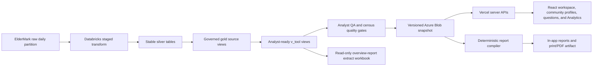

# Alamo Platform: Complete Product, Data, Analytics, and Reporting Map

- purpose: portable, source-grounded inventory of the complete Alamo Platform product, data, analytics, and reporting system for broader data-strategy planning
- status: authoritative strategic handoff based on the live repository as reviewed on 2026-08-03
- owners: executive leadership, product, engineering, data platform, analytics
- updated: 2026-08-03
- tags: alamo-platform, data-strategy, architecture, analytics, reports, eldermark, databricks
- labels: strategic-handoff, complete-platform-map, source-grounded


**Prepared:** 3 August 2026
**System of record reviewed:** `/Users/eric/CareEngineMain/alamo-platform-app`
**Purpose:** A portable, source-grounded inventory for designing a broader Alamo data strategy.
**Audience:** Executive leadership, data platform, analytics, clinical and operating leaders, product, security, and external technical reviewers.

---

## 1. How to use this document

This document maps the platform as it exists in code. It separates four things that are easy to confuse:

1. **Source data:** what ElderMark or another upstream system supplies.
2. **Governed data products:** what Databricks transforms, validates, and publishes.
3. **Application capabilities:** what deterministic tools, modules, questions, and reports can answer.
4. **Strategic gaps:** facts the current system cannot prove without new data.

“Available in the warehouse” does not automatically mean “published to the application.” High-volume detail is deliberately bounded in the daily snapshot. Likewise, an optional governed view can exist with zero rows when its upstream source is missing. This document calls out both conditions.

This is a current-state inventory, not a claim that every source value is complete or correct. Correctness depends on the daily quality gates, the explicit business-date partition, and the latest successfully published snapshot.

---

## 2. Platform at a glance

| Layer | Current inventory |
| --- | ---: |
| Protected application routes | 13 primary route patterns plus login and redirect fallback |
| Registered product surfaces | 10 |
| Registered analytical modules | 41 |
| Total module registry | 51 |
| Certified deterministic question families | 44 |
| Questions shown in the main menu | 31 |
| Governed long-form report families | 7 |
| ElderMark datasets transformed to silver | 32, plus generated census snapshot |
| Analyst-ready `v_tool_*` views | 27 |
| Verified-demand state dossiers | 15 |
| State hospital bed baselines | 50 states plus District of Columbia in the source file; 50 states in the product atlas |
| Detailed buyer-research states | 5 |
| Daily snapshot maximum transport size | 64 MB |
| Primary reporting time zone | `America/Los_Angeles` |

### Five operating communities

| Facility ID | Product name | Operating-site reference | Licensed capacity | Current operating limit | Capacity reference date |
| --- | --- | --- | ---: | ---: | --- |
| 337 | A & A Health Services San Pablo | San Pablo | 225 | 175 | 30 July 2026 |
| 342 | Victoria's House / Victoria's Place in source data | Shotwell | 46 | 46 | 30 July 2026 |
| 343 | JC Wallace House | Grand Terrace | 150 | 150 | 30 July 2026 |
| 344 | AHS Turlock OP LLC | Turlock | 84 | 84 | 30 July 2026 |
| 345 | Santa Clarita | Santa Clarita | 150 | 150 | 30 July 2026 |

Capacity values are a point-in-time reference registry. They are not historical capacity observations and must not be backfilled into historical reports.

---

## 3. Canonical architecture and lineage



### Runtime principles

- The normal application path is **snapshot-first**. Pages should not wait for Databricks.
- The Incident Center may try a live Databricks query first and fall back to the snapshot.
- The daily snapshot is the runtime boundary between integration and product.
- Deterministic tools own calculation, filtering, grain, scope, period, identity, and truth state.
- Claude, when used, may explain bounded evidence; it does not own calculations or replace the governed result.
- Visible resident counts, resident search, and community active-roster counts come from governed resident profiles, not raw occupancy or raw active-resident rows.
- `generated_at` is the JSON production time. It is not the reporting period.
- `snapshot.as_of_date` is the governed business date. All period labels and freshness logic must respect it.

### Daily publish sequence

1. `eldermark_staged_transform`
2. `mar_gold_views`
3. `tool_context_views`
4. `analyst_context_qa`
5. `census_quality_audit`
6. `snapshot_publish`

The full workflow is scheduled at 05:15 California time. A shorter snapshot refresh is scheduled at 06:00 and starts from MAR/gold rebuilding when silver is already current. Every task must receive the same explicit `date_partition`.

### Published objects

- `snapshots/daily/latest.json`
- `snapshots/daily/YYYY-MM-DD.json`

Default storage:

- account: `alamodatalake`
- container: `alamo-platform-snapshots`
- root: `snapshots/daily`

Publication is expected to be atomic. A failed or oversized package must not replace the last verified package.

---

## 4. Application route and surface map

### Live routes

| Route | Surface | Primary use |
| --- | --- | --- |
| `/login` | Microsoft sign-in | Entra sign-in and error handling |
| `/` | California home | Portfolio map, community entry points, question and Analytics carousel |
| `/home` | California home | Canonical home alias |
| `/home/community/:facilityId` | California home with community modal | Direct community operating profile |
| `/questions` | California home, question panel selected | On-rails analyst workspace |
| `/analytics` | California home, Analytics panel selected | Governed report catalog and reader |
| `/reports` | Analytics alias | Compatibility alias for Analytics |
| `/communities` | Communities overview | Portfolio census and community navigation |
| `/communities/:facilityId` | Community detail | Community census, incidents, medications, residents, and overview |
| `/incidents` | Incident Center | Current triage and incident operations |
| `/glossary` | Metric glossary | Definitions and interpretation |
| `/explorer/:kind` | Data Explorer/support surface | Bounded tabular detail for approved kinds |
| `/command-center` | Command Center | Health, QA, snapshot, and operational diagnostics |
| `/fiftystate` | State targeting atlas | National governance, demand, buyer, and opportunity research |
| `/data-architecture` | Data architecture | Data lineage, coverage, and strategic gaps |
| unknown path | Redirect to `/home` | Fail-safe navigation |

### Registered product surfaces

1. Communities overview
2. Community detail
3. Resident census search
4. Community census
5. Community incidents
6. Community residents
7. Incident Center
8. Data Explorer
9. Glossary
10. Command Center

### California home/community experience

- California and neighboring-state map illustration.
- Five geographically positioned community markers.
- Marker hover: community name and latest weekly census/change context.
- Marker click: full community modal.
- Community modal tabs: overview, census, incidents, medications, residents.
- Community resident search and profile drilldown.
- Category-to-incident-detail drilldown.
- Question and Analytics panels open in a horizontal carousel while preserving a return path to the map.
- Clicking outside the community modal closes it.

### Community operating profile

The community profile combines, where loaded:

- latest governed census and prior-period movement;
- current operating and licensed capacity position;
- monthly and weekly census trends;
- admissions, discharges, and net movement;
- current resident count and searchable roster;
- age, length of stay, diagnosis, unit, care level, payor, physician, and diet;
- incident volume, categories, resident drivers, and exact incident reports;
- medication compliance, refusal concentration, current orders, exception detail, PRN follow-up, and resident medication load;
- documentation gaps and resident watch signals.

### Support and administrative surfaces

- **Glossary:** metric definitions and grain distinctions.
- **Command Center:** backend health, snapshot diagnostics, QA artifacts, analyst trace telemetry, module coverage, freshness, and known issues.
- **Data Architecture:** source-to-product flow, coverage boundaries, and missing strategic data.
- **Data Explorer:** controlled detail access; it is not the primary executive workflow.

---

## 5. Authentication, authorization, and deployment

### Authentication

- Microsoft Entra ID through MSAL.
- Browser obtains a delegated token for `access_as_user`.
- Server validates token signature, tenant, API audience, delegated scope, and optional role requirements.
- Protected product routes require a valid signed-in session.

### Data and infrastructure credentials

- Azure Blob: service principal or connection string.
- Databricks: OAuth client credentials in production; PAT permitted only as a development fallback.
- Vercel: serverless API host and production deployment.

### Security boundary

- PHI-bearing resident, incident, medication, note, and assessment data is server-authorized.
- Large detail collections remain server-side or bounded in the snapshot.
- UI hiding is not authorization.
- Exports require the same organization, facility, resident-detail, and medication-detail scope checks as direct API access.
- A future multi-organization version needs explicit tenant isolation; the current code is Alamo/ElderMark specific.

---

## 6. API inventory

### Platform and operations

- `GET /api/platform/bootstrap` — authenticated application bootstrap.
- `GET /api/platform/health` — backend, warehouse, snapshot, MAR, historical coverage, QA, and freshness diagnostics.
- `GET /api/platform/analyst-qa` — analyst QA status and checks.
- `GET /api/platform/analyst-traces` — analyst-turn telemetry and module coverage.
- `GET /api/platform/snapshot-health` — snapshot size, age, readiness, and data-family diagnostics.
- `GET /api/platform/snapshot-metadata` — snapshot version, as-of date, generation time, and source metadata.

### Product data

- `GET /api/communities/dashboard` — facility directory, governed current residents, monthly incident aggregates, and census.
- `GET /api/communities/snapshot?facilityId=...` — community-specific operating profile.
- `GET /api/home-dashboard` — portfolio/community home metrics.
- `GET /api/incidents` — Incident Center feed with live-first/snapshot-fallback behavior.
- `GET /api/analytics-summary` — analytics/report-support summary.
- Data Explorer API — bounded approved rows for the requested explorer kind.

### Analyst

- `POST /api/chat/tools` — deterministic tool execution.
- `POST /api/chat/intent` — bounded intent compilation/routing support.
- `POST /api/chat/session/reset` — analyst session reset.
- `POST /api/chat/claude/message` — bounded evidence explanation.
- `GET /api/chat/claude/health` — Claude availability.

### Reports

- `GET /api/reports/status` — governed reporting readiness.
- `POST /api/reports/create` — short report creation.
- `POST /api/reports/email` — delivery hook; external delivery configuration is a separate dependency.
- `GET /api/reports/full/definitions` — server-owned report catalog.
- `POST /api/reports/full/create` — deterministic long-form report compilation.
- `POST /api/reports/weekly/preview` — weekly briefing preview.
- `GET /api/reports/weekly` — scheduled weekly endpoint protected by `CRON_SECRET`.

---

## 7. ElderMark source inventory

The staged transform processes 32 source datasets. Source columns are vendor-defined and can evolve; this section lists every governed source dataset, while later sections list every field in the stable application contracts.

### Facility-scoped sources

1. `Resident` → `silver.resident`
2. `Res_Leave_of_Absence` → `silver.res_leave_of_absence`
3. `Allergies` → `silver.allergies`
4. `Med_Incident` → `silver.med_incident`
5. `Notes` → `silver.notes`

### Resident-number-scoped sources

6. `Res_Admittance_History` → `silver.res_admittance_history`
7. `Res_Unit_History` → `silver.res_unit_history`
8. `Res_Medications` → `silver.res_medications`
9. `Res_Incident` → `silver.res_incident`
10. `Res_Diagnosis` → `silver.res_diagnosis`
11. `Assessment` → `silver.assessment`
12. `Res_Payor` → `silver.res_payor`
13. `Scheduled_Employee` → `silver.scheduled_employee`
14. `Res_Contacts` → `silver.res_contacts`
15. `Res_Pharmacy` → `silver.res_pharmacy`
16. `Res_Med_Professionals` → `silver.res_med_professionals`
17. `Res_Immunization` → `silver.res_immunization`
18. `Service_Plan` → `silver.service_plan`
19. `Med_Delivery` → `silver.med_delivery`

### Global reference sources

20. `Companies` → `silver.companies`
21. `Units` → `silver.units`
22. `Unit_Types` → `silver.unit_types`
23. `Service_Type` → `silver.service_type`
24. `Med_Schedule_Codes` → `silver.med_schedule_codes`
25. `Diagnosis` → `silver.diagnosis`
26. `MEDNAME` → `silver.medname`
27. `MEDNDC` → `silver.medndc`

### Employee sources

28. `Employee` → `silver.employee`
29. `Medical_Professionals` → `silver.medical_professionals`

### Unscoped operational sources

30. `Inquiry` → `silver.inquiry`
31. `Prospect` → `silver.prospect`
32. `Service_Archive` → `silver.service_archive`

### Generated silver output

- `Census_Snapshot` → `silver.census_snapshot`

### Parsed date families

- Admission history: admit date, discharge date.
- Unit history: move in/out, physical move in/out, create date.
- Medication orders: effective, prescription end, archive.
- Resident incidents: incident date.
- Medication incidents: incident, notify, and related dates.
- Diagnosis: onset, resolve, create.
- Assessments: assessment date.
- Leave of absence: from and to dates.
- Notes: entry, action-required-by, incident, and late-entry dates.
- Immunization: received and create dates.
- Service plans: effective, end, create.
- MAR delivery: scheduled, given/recorded, PRN result, and create dates.
- Scheduled services: service date.

ElderMark bang dates are parsed only as `day!month!four-digit-year`. Malformed, impossible, or century-ambiguous dates become null; they are not reinterpreted.

---

## 8. Core governance rules

### Resident countability

The silver transform adds governed countability and exclusion logic. A countable resident needs a usable resident number, valid admit date, no impossible discharge order, no source non-resident flag, and no obvious placeholder/test identity.

Excluded name patterns include test, fake, dummy, sample, training, demo, do-not-use, and similar placeholder markers. Countability audit fields preserve the decision and reason.

### Monthly census

- Count distinct resident numbers, not rows.
- A resident is active at month end when admit date is on or before month end and discharge date is null or after month end.
- Exclude non-countable and suspect test residents.
- Routine history is 52 months.
- `census_history_months=0` is only for an intentional full-history rebuild.

### Weekly census and movement

- Weekly change means census on the governed business date minus census exactly seven calendar days earlier.
- The platform does not substitute the previous available upload and call it weekly.
- Weekly admission/discharge series are reconstructed from episode dates and zero-filled for quiet weeks.
- Irregular uploads do not create false operational gaps.
- Weekly history begins with governed census coverage; malformed old dates cannot manufacture decades of zero rows.

### Incident metrics

- **Incident events:** count of incident records.
- **Unique residents:** distinct resident IDs involved in matching incidents.
- These grains are never interchangeable.
- Categories are normalized into an operational taxonomy while retaining original incident type and exact narrative detail.

### Medication metrics

- Compliance is weighted from scheduled and given counts, not an unweighted average of percentages.
- Outcomes normalize to given, refused, AWOL, hospital, offsite with meds, held, other not given, or unknown.
- Exception detail includes non-given rows and administrations over 60 minutes late.
- PRN follow-up is distinct from PRN administration.

### Truth states

The platform distinguishes:

- valid records;
- verified zero;
- unavailable detail;
- unsupported source;
- stale data;
- rejected execution plan;
- bounded preview with full export;
- optional source with an empty typed view.

---

## 9. Governed gold source views

The tool layer depends on these core governed views:

- `v_occupancy` — source/audit occupancy.
- `v_active_residents` — source/audit active roster.
- `v_census` — governed monthly census.
- `v_incidents` — resident incidents joined to facility names with parsed dates.
- `v_mar` — medication delivery with parsed dates.
- `v_medication_compliance` — administration compliance aggregates.
- `v_refusal_by_medication` — refusal concentration.
- `v_documentation_gaps` — note recency gaps.

Raw occupancy and active-resident views are audit inputs, not user-facing census truth.

---

## 10. Complete analyst-ready data catalog

The following 27 `v_tool_*` views are the canonical analytics slices. Fields are the published application contract, not every raw vendor column.

### 10.1 Community operating summary

**View:** `v_tool_community_operating_summary`
**Grain:** one current row per community
**Fields:** facility ID, facility name, resident-profile row count, census month, census, prior census, census delta, incident month, incident events, incidents per 100 residents, average age, average length of stay in days, medication month, medication compliance percent, documentation-gap resident rows, largest documentation gap in days.

### 10.2 Monthly census by community

**View:** `v_tool_census_monthly_by_community`
**Grain:** community-month
**Fields:** facility ID, facility name, month bucket, snapshot date, census, prior census, census delta.

### 10.3 Weekly census by community

**View:** `v_tool_census_weekly_by_community`
**Grain:** community-week
**Fields:** facility ID, facility name, week start, week end, census date, exact prior census date, month bucket, census, census seven days prior, seven-day census change.

### 10.4 Census quality

**View:** `v_tool_census_data_quality`
**Grain:** community audit row
**Fields:** facility ID, facility name, latest census month, latest monthly census, active roster residents, current active roster residents, current active minus latest census, monthly census minus active roster, prior census, census delta, excluded/non-countable rows, suspected test rows, exclusion reasons, minimum week, maximum week, weekly census row count.

### 10.5 Resident countability audit

**View:** `v_tool_resident_countability_audit`
**Grain:** resident/facility audit row
**Fields:** facility ID, facility name, resident number, resident name, admit date, discharge date, countable-resident flag, suspect-test-resident flag, exclusion reason.

### 10.6 Current resident profile

**View:** `v_tool_resident_profile`
**Grain:** current governed resident
**Fields:** resident number, resident name, first name, last name, age, admit date, length of stay days, facility ID, facility name, unit number, care level, payor text, primary diagnosis, physician name, diet.

### 10.7 Enriched resident profile

**View:** `v_tool_resident_profile_enriched`
**Grain:** current governed resident
**Fields:** every current resident-profile field plus all-time incident count, 30-day incident count, 90-day incident count, 180-day incident count, last incident date, last incident category, last note date, and days since last note.

### 10.8 Resident incident summary

**View:** `v_tool_resident_incident_summary`
**Grain:** resident rollup
**Fields:** facility ID, facility name, resident number, resident name, all-time incident count, 30-day count, 90-day count, 180-day count, last incident date, last incident category.

### 10.9 Resident episode history

**View:** `v_tool_resident_episode_history`
**Grain:** resident admission episode
**Fields:** episode ID, facility ID, facility name, resident number, resident name, admit date, discharge date, discharge reason, discharge destination, current/discharged episode status, month bucket, source table.

### 10.10 Weekly resident flow

**View:** `v_tool_resident_flow_weekly_by_community`
**Grain:** community-week
**Fields:** facility ID, facility name, week start, month bucket, admissions, discharges, net change, admitted resident IDs/names payload, discharged resident IDs/names payload, source row count.

### 10.11 Monthly resident flow

**View:** `v_tool_resident_flow_monthly_by_community`
**Grain:** community-month
**Fields:** facility ID, facility name, month bucket, admissions, discharges, net change, admitted resident IDs/names payload, discharged resident IDs/names payload, source row count.

### 10.12 Resident unit history

**View:** `v_tool_resident_unit_history`
**Grain:** resident unit episode
**Fields:** facility ID, facility name, resident number, resident name, unit number, start date, end date, month bucket.

### 10.13 Incident monthly by community and category

**View:** `v_tool_incident_monthly_by_community_category`
**Grain:** community-month-category
**Fields:** facility ID, facility name, normalized incident category, month bucket, incident count, distinct resident count, latest incident date.

### 10.14 Current-month incident detail

**View:** `v_tool_incident_detail_current_month`
**Grain:** incident event
**Fields:** unique incident ID, facility ID, facility name, resident number, first name, last name, unit, parsed incident date, source timestamp, normalized category, original incident type, general location, specific location, what staff saw, assistance given, injury flag, emergency-services flag, sentinel-event flag, previous-history flag, physician/family/manager notification flags and names where available, person completing report, month bucket.

### 10.15 Historical incident detail

**View:** `v_tool_incident_detail_history`
**Grain:** incident event
**Fields:** same as current-month incident detail, across governed history.

### 10.16 Documentation status

**View:** `v_tool_documentation_status`
**Grain:** current resident
**Fields:** resident number, resident name, facility ID, facility name, last note date, days since last note.

### 10.17 Notes summary

**View:** `v_tool_notes_summary`
**Grain:** note event
**Fields:** facility ID, facility name, resident number, resident name, note date, month bucket, note type, note text, action-required-by date.

### 10.18 Services provided

**View:** `v_tool_services_provided`
**Grain:** resident service event
**Fields:** facility ID, facility name, resident number, resident name, service date, month bucket, service type, employee ID, service status, service units, source table.

### 10.19 Assessment summary

**View:** `v_tool_assessment_summary`
**Grain:** resident assessment event
**Fields:** facility ID, facility name, resident number, resident name, assessment date, month bucket, assessment type, assessment status, assessment score.

### 10.20 Medication refusal summary

**View:** `v_tool_medication_refusal_summary`
**Grain:** facility-medication
**Fields:** facility ID, medication, total scheduled administrations, refusals, refusal percent.

### 10.21 Medication compliance monthly

**View:** `v_tool_medication_compliance_monthly`
**Grain:** facility-month
**Fields:** facility ID, facility name, month bucket, total scheduled, given, not given, weighted compliance percent.

### 10.22 MAR monthly by community and medication

**View:** `v_tool_mar_monthly_by_community_medication`
**Grain:** facility-month-medication
**Fields:** facility ID, facility name, month bucket, medication name, administration count, scheduled count, given count, not-given count, refusal count, PRN-given count, AWOL count, hospital count, unknown count, distinct resident count, weighted compliance percent.

### 10.23 MAR resident summary

**View:** `v_tool_mar_resident_summary`
**Grain:** current resident
**Fields:** resident ID, resident name, facility ID, facility name, active medication count, active psychotropic count, active narcotic count, active PRN count, scheduled/given/refusal counts for 7 days, scheduled/given/not-given/refusal counts for 30 days, scheduled/given/not-given/refusal counts for 90 days, last recorded date, PRN-given count in 30 days, PRN-follow-up count in 30 days, 30-day compliance percent.

### 10.24 MAR exception detail, 90 days

**View:** `v_tool_mar_exception_detail_90d`
**Grain:** administration exception
**Fields:** administration ID, medication-order ID, resident ID/name, facility ID/name, medication name, dosage, route, administration date, scheduled date/time, recorded date, administration outcome, normalized outcome category, not-given reason, missed/held reason, on-hold flag, PRN flag, PRN reason, PRN result, PRN-result date, administration note, minutes late, refusal flag, over-60-minutes-late flag, month bucket.

### 10.25 MAR PRN effectiveness, 90 days

**View:** `v_tool_mar_prn_effectiveness_90d`
**Grain:** PRN administration
**Fields:** administration ID, medication-order ID, resident ID/name, facility ID/name, medication name, dosage, route, administration date, scheduled date, recorded date, administration outcome, PRN reason, PRN result, PRN-result date and time/when, follow-up-present flag, month bucket.

### 10.26 Current medication orders

**View:** `v_tool_mar_medication_orders_current`
**Grain:** active medication order
**Fields:** medication-order ID, resident ID/name, facility ID/name, medication name, dosage, route, schedule, passing times, instructions, indication, prescriber code, diagnosis code, narcotic flag, psychotropic flag, PRN flag, on-hold flag, effective date, prescription end date.

### 10.27 Tool-context manifest

**View:** `v_tool_context_manifest`
**Grain:** one row per published analytical slice
**Fields:** slice name, grain, row count, minimum period, maximum period, facility IDs, field list, generated timestamp.

This manifest is the machine-readable inventory used to explain what is actually loaded. It should become the basis for future catalog automation.

---

## 11. MAR gold model

The medication pipeline creates reusable gold views before the bounded tool views.

### Current medication orders

Fields include order/resident/facility identity, medication, dose, route, schedule, passing times, instructions, indication, prescriber, diagnosis, narcotic/psychotropic/PRN/on-hold flags, effective/end/archive dates, and source timestamp.

### Administration detail

Fields include administration/order/resident/facility identity, medication/dose/route/schedule, narcotic and psychotropic flags, administration/scheduled/recorded dates and times, minutes late, outcome, not-given and held reasons, on-hold and PRN flags, PRN reason/result/date/time, note, recording/pouring employee, source timestamp, normalized outcome category, refusal flag, over-60-minutes-late flag, and month.

### Derived MAR products

- exception detail;
- PRN effectiveness;
- monthly community-medication execution;
- resident medication summary;
- medication data quality.

### MAR quality fields

Row count, distinct administration IDs, given/not-given/unknown outcomes, unknown percentage, earliest/latest dates, future-dated rows, missing resident rows, and missing medication rows.

---

## 12. Snapshot contract and bounded retention

### Top-level package

- `snapshot`: version, generated time, governed as-of date, source metadata.
- `communities`: facility directory, current governed residents, incident aggregates, census.
- `incidents`: Incident Center records.
- `reportsSummary`: census, medication compliance, refusal, documentation, and tool context.
- `communitySnapshots`: lightweight prebuilt community payloads where used.
- `health`: readiness and quality diagnostics.
- `homeDashboard`: map/home summary.

### Communities fields

**Facilities:** facility ID, community name, community code, city, state, total residents.
**Residents:** resident number, first/last name, age, admit date, length of stay, facility ID/name, unit, care level, payor, diagnosis, physician, diet.
**Incident aggregate:** facility ID, category, incident date, month bucket, incident count, period.
**Census:** facility ID, census, month bucket.

### Incident-detail application shape

Incident ID, facility ID/name, resident ID, client name, unit, incident date, received time, month, category, original type, location, injury flag, police/emergency-services flag, sentinel flag, prior-history flag, staff name, staff narrative, assistance, notifications, and derived flags.

### Reports summary shape

- census by facility/month;
- medication compliance by facility/month: scheduled, given, not given, percent;
- refusal by facility/medication: scheduled, refusals, percent;
- documentation gaps by resident/facility: last note and days since note;
- complete bounded `toolContext` tables and manifest.

### Bounded publication windows

| Slice | Snapshot bound |
| --- | --- |
| Current incident detail | 750 rows |
| Historical incident detail | last 18 months, maximum 15,000 rows |
| Enriched current resident profiles | maximum 1,000 rows |
| Resident incident summary | maximum 500 rows |
| Documentation status | maximum 500 rows |
| Census quality | maximum 500 rows |
| Resident countability audit | maximum 2,500 rows |
| Resident unit history | last 60 months, maximum 15,000 rows |
| Services provided | last 18 months, maximum 15,000 rows |
| Assessments | last 24 months, maximum 10,000 rows |
| Notes | last 12 months, maximum 15,000 rows |
| Medication refusal summary | maximum 500 rows |
| MAR monthly by medication | maximum 15,000 rows |
| MAR resident summary | maximum 1,000 rows |
| MAR exception detail | complete governed 90-day bounded view, additionally size-managed at publish time |
| MAR PRN effectiveness | complete governed 90-day bounded view, additionally size-managed at publish time |
| Current medication orders | current governed orders, size-managed at publish time |

The snapshot is an application package, not a substitute for the complete warehouse. Full-history or unbounded extracts belong in governed warehouse exports or a purpose-built detail API.

---

## 13. Certified analyst question catalog

The analyst is “on rails.” A selected question compiles into a deterministic capability with approved selectors, tool, answer contract, visual module, evidence, and follow-up routes. Free text is not the source of truth.

### Incident questions

1. Incident unique people count
2. Incident event count
3. Incident freshness troubleshoot
4. Current incident snapshot
5. Incident detail list
6. Export exact incident detail
7. Incident category breakdown
8. Top incident category by community
9. Incident category by community
10. Incident period comparison
11. Incident rate by community
12. Incident rate change
13. Top resident incident drivers

### Census and resident-flow questions

14. Census point count
15. Weekly resident flow
16. Census trend
17. Census movement
18. Census drop history

### Community and portfolio questions

19. Community operating picture
20. Community trends over time
21. Current community profile
22. Community change summary
23. Community comparison
24. Operating snapshot

### Resident questions

25. Resident medication summary
26. Resident profile
27. Resident change summary
28. Resident incident history
29. Resident search
30. Resident watch summary
31. Diagnosis mix
32. Length of stay

### Medication questions

33. Current medication orders
34. Medication exception detail
35. Medication refusal detail
36. Medication watch
37. Medication profile
38. Medication compliance
39. Medication compliance history

### Data and platform questions

40. Exact data detail list
41. Loaded data availability
42. Module catalog
43. Platform module surface
44. Available data slices

Thirty-one of these families appear in the main menu. The remainder support drilldown, export, troubleshooting, module routing, and follow-up behavior.

### Selector dimensions

Depending on the family, selectors can include:

- portfolio or community;
- one or more communities;
- month or period range;
- incident category;
- resident;
- event count versus distinct people;
- medication outcome/exception type;
- current versus historical scope;
- export versus preview.

### Certified follow-up graph

Examples:

- community profile → census trend, incident categories, resident roster;
- census view → movement, exact rows, incident comparison;
- incident summary → categories, resident drivers, exact reports;
- resident profile → incident history, community context, export;
- medication compliance → refused medications → exact exception rows → resident watch;
- community comparison → census movement, incident rates, resident watch.

---

## 14. Analytical module catalog

### Operations and community modules

- Community profile — summary card
- Operating snapshot — summary card
- Community time series — multi-line chart
- Metric slice — table
- Data detail list — table
- Data availability — table
- Community comparison — table
- Period comparison — comparison chart
- All-incidents search — table
- Community incident drivers — table

### Census modules

- Census trend — line chart
- Census movement — comparison chart
- Census drop history — table
- Census search — table

### Incident modules

- Incident breakdown — bar chart
- Incident detail list — table
- Incident resident drivers — table
- Incident category comparison — comparison chart
- Incident rate — table
- Incident rate change — comparison chart

### Resident modules

- Resident profile — profile card
- Resident incident history — table
- Resident search results — table
- Resident search — table
- Weekly resident flow — table
- Resident watch summary — ranked list
- Diagnosis mix — donut chart
- Resident demographics — bar chart
- Length of stay — donut chart
- Resident medication profile — profile card
- Documentation gaps — table

### Medication modules

- Medication profile — summary card
- Medication watch — table
- Medication compliance — table
- Current medication orders — table
- Medication refusals — bar chart
- Medication exceptions — table
- Medication refusal detail — table
- Late administrations — table
- Held administrations — table
- PRN detail — table

Large detail results render a bounded preview and preserve the exact full-row export when permitted.

---

## 15. Governed report and briefing catalog

Reports are deterministic documents compiled from the published snapshot. They are not free-text drafts. Report scope, period, metrics, narrative, visuals, evidence, and print artifact are owned by the compiler.

### 15.1 Portfolio overview

**Scope:** portfolio
**Period:** latest governed period or selected overlap month
**Audience:** executive and operations
**Content:** census, community position, resident flow, incidents, medication execution, capacity, resident watch, source evidence.

### 15.2 Community performance

**Scope:** one community
**Period:** census/incident/medication overlap
**Audience:** operations leaders
**Content:** census, admissions/discharges, residents, incidents, medication execution, diagnoses, capacity, and watch items.

### 15.3 Effectiveness evidence

**Scope:** portfolio or community
**Period:** latest or selected overlap month
**Audiences:** county purchaser, state purchaser, managed-care organization, provider/referral partner, executive
**Content:** access/capacity, current acuity, stabilization signals, medication execution, internal continuity, and explicit evidence gaps. It does not overstate causation.

### 15.4 Census and resident flow

**Scope:** portfolio or community
**Period:** every loaded census month
**Content:** census history, weekly/monthly admissions, discharges, net movement, community comparison, exact evidence.

### 15.5 Incident and safety review

**Scope:** portfolio or community
**Period:** every loaded incident month
**Content:** historical incident direction, category concentration, event-versus-resident grain, resident/community drivers, exact incident drilldown.

### 15.6 Medication performance

**Scope:** portfolio or community
**Period:** every loaded medication month
**Content:** weighted compliance, scheduled/given/not-given, refusal concentration, current order burden, exceptions, PRN follow-up, and source evidence.

### 15.7 Resident population

**Scope:** portfolio or community
**Period:** current state
**Content:** current population, age, diagnosis mix, length of stay, longest stays, incident and medication watch context.

### Other reporting flows

- Short governed report creation endpoint.
- Weekly briefing preview.
- Scheduled weekly briefing endpoint.
- Standalone print-ready HTML.
- Browser print/PDF export.
- HTML download.
- Email delivery hook, pending approved delivery configuration.

### Report evidence contract

Every long-form report shows:

- requested scope and period;
- data-through date;
- snapshot updated time;
- stale warning when applicable;
- unavailable versus zero distinctions;
- source slices and row counts;
- deterministic-calculation statement.

---

## 16. Governed overview-report extract

The read-only Databricks notebook `overview_report_extract.py` produces an analyst workbook/ZIP without changing views or publishing the app.

### Extract sections

1. Dataset coverage and reporting window
2. Quarterly operating scorecard
3. Weekly census and resident flow
4. Monthly census and resident flow
5. Current length of stay
6. Completed length of stay by discharge quarter
7. Discharge outcome coverage and provisional classification
8. Internal readmissions at 30, 90, and 180 days
9. Incident trend, severity, and category mix
10. Medication execution and refusal concentration
11. Current resident age and diagnosis mix
12. Services provided
13. Assessments
14. Notes and documentation coverage
15. Unit placement history
16. Census and context-manifest quality evidence

### Important boundaries

- Provisional discharge-outcome mapping needs business-owner approval before publishing a successful-discharge percentage.
- Internal repeat episodes are not external recidivism.
- Historical licensed/staffed capacity is not available.
- County, IMD, jail, and hospital cost comparisons need approved external benchmarks.
- The notebook is an export, not a daily platform task.

---

## 17. Fifty-state targeting and research atlas

### National targeting record for every state

Each state record contains:

- state name and abbreviation;
- governance bucket and one or more governance codes;
- primary governance code and label;
- state authority;
- primary buyer/target;
- target universe;
- decision-concentration description;
- target job titles;
- research pitch;
- opportunity-path codes;
- relevance tags;
- recommended effectiveness-report audience;
- audience-fit scores.

### Governance codes

- `C`: county/local-government led
- `R`: regional public-authority led
- `S`: state led
- `M`: managed-care led
- `H`: hybrid

### Opportunity paths

- `A`: direct local-government
- `B`: regional public-system
- `C`: concentrated state
- `D`: managed care
- `E`: provider-network first

### National bed baseline

For each state:

- state-hospital beds per 100,000;
- supply rank;
- comparison universe;
- gap to a 50-beds-per-100,000 benchmark;
- metric definition;
- confidence;
- source and as-of date.

This is a state-hospital capacity baseline. It does not by itself prove demand, addressable revenue, procurement timing, or fit.

### Fifteen verified-demand states

1. California
2. Washington
3. Oregon
4. Texas
5. New York
6. Florida
7. Iowa
8. Michigan
9. Massachusetts
10. North Carolina
11. Virginia
12. Georgia
13. Delaware
14. Arizona
15. Nevada

Each verified dossier adds:

- composite demand rank and rationale;
- involuntary-treatment/conservatorship mechanism;
- published volume when available, otherwise a reason it is unavailable;
- state psychiatric bed rate/year/confidence/source;
- state-hospital pressure fact;
- placement bottleneck fact;
- step-down registry/capacity fact;
- confidence per fact;
- source links;
- research boundary.

### Five buyer-research states

- California
- Washington
- Oregon
- Texas
- New York

Buyer dossiers can contain:

- county or region and rank;
- population;
- one or more buyers and buyer role/logic;
- named leaders and titles;
- demand evidence;
- procurement name, identifier, status, dates, portal, service period, term, proposal model, allocation/funding, capacity, awards, eligibility, and plan statement where published;
- recent contract precedent;
- published monthly rates;
- economics benchmark;
- recommended Alamo pitch;
- barriers;
- first-outreach organization, entry point, lead problem, and offer;
- state-level demand and economics;
- cross-cutting gaps, next actions, and source URLs.

Opportunity statuses remain explicit: active, scheduled/status to verify, closed or pending, closed, recent precedent, or not publicly located.

### Atlas filters and sorting

- priority states versus all states;
- search by state, buyer, region, leader, role, or research concept;
- governance structure;
- opportunity path;
- state name;
- research priority;
- verified demand;
- buyer-research coverage.

### Atlas limitations

- Demand rank is not a revenue forecast.
- Bed supply is not a complete market score.
- Five-state buyer research is not national buyer coverage.
- Public procurement status can change and needs continuous verification.
- Reimbursement, comparative cost, provider licensing, contracting eligibility, and procurement timing remain separate diligence tracks.
- Market research does not establish clinical causation.

---

## 18. Current computed metrics

### Census and capacity

- monthly census by community;
- exact seven-day weekly census change;
- prior-month census and delta;
- portfolio census;
- community share and ranking;
- current operating utilization;
- current licensed utilization;
- open capacity to operating limit;
- open licensed capacity;
- admissions, discharges, and net movement by week/month;
- census drops across loaded history;
- source-to-governed census reconciliation.

### Residents

- current governed resident count;
- current age and average age;
- length of stay and average LOS;
- diagnosis mix;
- longest stays;
- current unit, care level, payor, physician, diet;
- admission episodes and episode days;
- discharge-reason and destination coverage;
- internal repeat admission at 30/90/180 days;
- resident incident counts and latest incident;
- note recency and documentation gaps;
- current medication burden.

### Incidents

- event count;
- distinct resident count;
- category mix;
- month-over-month comparison;
- incident rate per 100 residents;
- rate change;
- top resident drivers;
- top community/category drivers;
- injury, emergency-services, sentinel, and prior-history flags;
- location, narrative, assistance, notifications, and report author where available.

### Medications

- scheduled, given, and not-given counts;
- weighted compliance percent;
- refusal counts/rates by community and medication;
- AWOL, hospital, offsite-with-meds, held, other-not-given, and unknown outcomes;
- PRN administrations and follow-up coverage;
- late administrations and minutes late;
- current orders;
- active medication, psychotropic, narcotic, and PRN burden;
- 7-, 30-, and 90-day resident execution metrics;
- medication freshness and unknown-outcome quality.

### Documentation, services, and assessments

- last note date and days since note;
- note type, text, action-required date;
- service type/status/units/employee and date;
- assessment type/status/score and date;
- source coverage by period and facility.

---

## 19. What the platform cannot yet prove

These must remain named gaps until governed sources exist:

### Clinical and effectiveness outcomes

- complete successful discharge to lower level of care;
- complete, approved discharge-reason and destination taxonomy;
- external readmissions or recidivism after leaving Alamo;
- psychiatric hospitalization, ED use, 5150 holds, jail episodes, and failed placements before admission;
- post-discharge acute utilization;
- repeated standardized clinical/functional assessment change;
- causal attribution of incident or medication trends to Alamo care;
- complete conservatorship/legal status;
- complete admission source/prior setting;
- housing stability after discharge.

### Financial and contracting outcomes

- resident-level county rate and total cost;
- approved IMD, psychiatric hospital, ED, jail, and alternative-placement benchmarks;
- avoided days and cost avoidance;
- claims, denials, authorizations, and payer reconciliation;
- contract, referral, and bed reservation pipeline;
- historical licensed, staffed, and sellable capacity;
- labor and operating cost by resident/community;
- revenue, margin, and contribution by service line/payer.

### Data-operating gaps

- durable enterprise data catalog with owners and SLAs;
- durable analyst/recovery telemetry store;
- field-level source lineage and provenance in the runtime package;
- master resident identity across systems;
- explicit organization/tenant model;
- public versioned source-adapter contract;
- historical source-watermark and late-arriving-change ledger;
- approved data-retention policy by domain;
- governed external-market-research refresh process.

---

## 20. Recommended broader data strategy

### Priority 1: establish the canonical model

Create versioned canonical entities for:

- organization;
- facility and capacity observation;
- resident identity;
- admission episode;
- census observation;
- resident movement;
- incident event;
- diagnosis;
- medication order;
- medication administration;
- service event;
- assessment;
- clinical/operational note metadata;
- payer/authorization/claim;
- referral and admission source;
- discharge outcome;
- external utilization event;
- cost benchmark;
- source provenance and quality result.

Every record should include organization-scoped identity, source identity, event/effective time, ingestion time, source watermark, adapter version, mapping version, and provenance.

### Priority 2: fix the outcome spine

The admission episode should become the central longitudinal record. Add governed fields for:

- admission source and prior level of care;
- referral authority and payer;
- legal/conservatorship status;
- discharge reason;
- discharge destination/level of care;
- successful versus unsuccessful disposition using an approved taxonomy;
- return/readmission inside Alamo;
- external acute utilization and readmission;
- post-discharge follow-up windows.

Do not extrapolate undocumented discharge outcomes. Report coverage and unknowns separately until the taxonomy and source recovery are approved.

### Priority 3: create an effectiveness evidence mart

At resident-month and episode level, combine:

- days since admission;
- incident events and sentinel events;
- PRN psychotropic administrations;
- scheduled adherence/refusal;
- active medication burden;
- service intensity;
- repeated assessment scores;
- hospital/ED/jail use;
- discharge outcome;
- external readmission;
- bed days and approved cost benchmarks.

This enables stabilization curves, risk-adjusted outcomes, cohort comparisons, and credible purchaser-facing evidence.

### Priority 4: separate warehouse, product package, and export contracts

- **Warehouse:** complete governed history.
- **Application package:** fast, bounded, current detail and historical aggregates.
- **Detail API/export:** authorized unbounded or paginated retrieval.
- **Research mart:** public-source market intelligence with citation/version status.

This removes pressure to fit complete history into a 64 MB JSON package.

### Priority 5: add catalog, ownership, and SLAs

For every dataset and metric, record:

- owner and steward;
- source system;
- refresh frequency;
- expected lateness;
- retention;
- sensitivity/PHI classification;
- business definition;
- grain and keys;
- quality tests and tolerance;
- downstream products;
- known limitations;
- version and change history.

### Priority 6: productize integration boundaries

- source-adapter SDK/contract;
- canonical-record schemas;
- organization/facility identity model;
- tenant-aware authorization;
- metric versioning;
- capability availability contract;
- package checksum and atomic publication;
- embedded-module and API contracts;
- durable recovery cases.

### Priority 7: operationalize market intelligence

For priority states and buyers, maintain:

- source URL and publication date;
- last verification date;
- legal/regulatory pathway;
- demand and placement-pressure measures;
- buyer map and decision authority;
- procurement status and dates;
- reimbursement/rate information;
- licensing and contracting requirements;
- provider landscape;
- target population and geography;
- evidence package required;
- opportunity stage, owner, next action, and confidence.

Use the Alamo effectiveness report as the reusable evidence package, but never infer a state opportunity solely from a demand rank.

---

## 21. Proposed data-product roadmap

### 0–30 days

- Assign owners to all 27 tool views and seven reports.
- Turn the tool-context manifest into a daily catalog export.
- Publish a data coverage scorecard for episodes, discharge outcomes, services, assessments, notes, and MAR.
- Approve the discharge-reason/destination taxonomy.
- Add an authorized paginated detail/export path for history outside the snapshot.
- Lock snapshot business-date and late-data SLAs.
- Add capacity history rather than a current-only registry.

### 31–90 days

- Load referral/admission source and legal/conservatorship data.
- Add claims/authorization and county-rate feeds.
- Add hospital/ED/jail utilization where lawful and available.
- Establish master resident/episode identity across feeds.
- Build the effectiveness evidence mart and stabilization curves.
- Store analyst traces and recovery cases durably.
- Create state/buyer research refresh ownership and status monitoring.

### 3–6 months

- Launch purchaser-facing effectiveness reports with approved outcomes and costs.
- Introduce external readmission/recidivism measures.
- Add contract/referral/bed-demand pipeline data.
- Version and publish canonical and metric contracts.
- Generalize ElderMark mappings into a source adapter.
- Add organization/tenant isolation for external use.

### 6–12 months

- Risk-adjusted community and cohort benchmarking.
- Forecast census, staffing, and capacity demand.
- Closed-loop buyer opportunity and contract-performance analytics.
- Embedded modules/API for partner systems.
- Governed research and operational knowledge graph spanning states, buyers, facilities, residents, episodes, outcomes, and contracts.

---

## 22. Quality and release controls

### Data gates

- manifest presence and coverage;
- resident-profile and census history availability;
- exact weekly census arithmetic;
- resident countability and suspect-row exclusions;
- incident aggregate-to-detail reconciliation;
- resident incident rollup reconciliation;
- MAR IDs, orders, execution summaries, exception and PRN reconciliation;
- medication freshness and unknown outcomes;
- latest community coverage;
- no future rows beyond the governed as-of date;
- snapshot size and required-section contract.

### Application checks

The repository has dedicated checks for:

- auth redirect and API boundaries;
- source syntax, TypeScript, lint, unused and duplicate code;
- module registry and tool registry;
- analyst capabilities and decision contracts;
- query understanding, intent, and scope;
- answer format, contract, quality, and data depth;
- weekly analysis and ElderMark date parsing;
- report catalog and all seven report compilers;
- 50-state atlas;
- community, MAR, Data Explorer, question, report, mobile, scroll, performance, and production browser journeys;
- release and ship profiles.

Canonical repository verification:

```bash
npm run check:docs
npm run typecheck
npm run check:analyst
npm run build
```

Release-grade verification also uses `npm run check:release` or `npm run check:ship` with a clean-room browser and required signed-in production smoke.

---

## 23. Source-of-truth file map

### Product and architecture

- `src/app/App.tsx`
- `docs/platform/architecture.md`
- `docs/platform/product-surfaces.md`
- `docs/platform/user-journeys.md`
- `docs/platform/integration-platform.md`

### Data publishing

- `databricks/notebooks/eldermark_staged_transform.py`
- `databricks/notebooks/mar_gold_views.py`
- `databricks/notebooks/tool_context_views.py`
- `databricks/notebooks/analyst_context_qa.py`
- `databricks/notebooks/census_quality_audit.py`
- `databricks/notebooks/snapshot_publish.py`
- `databricks/notebooks/overview_report_extract.py`
- `databricks/workflows/daily_platform_publish.json`
- `databricks/workflows/daily_snapshot_refresh.json`
- `docs/platform/data-publishing.md`

### Analyst and modules

- `shared/certified-analyst-questions.mjs`
- `shared/platform-module-registry.mjs`
- `shared/metric-definitions.mjs`
- `docs/platform/analyst-system.md`

### Reports

- `shared/full-report.mjs`
- `shared/effectiveness-evidence.mjs`
- `server/full-reporting.mjs`
- `src/features/reports/pages/ReportsPage.tsx`
- `src/features/reports/components/FullReportReader.tsx`
- `docs/platform/full-reporting.md`

### Runtime snapshot and APIs

- `src/shared/types/platformSnapshot.ts`
- `server/platform-snapshot.mjs`
- `server/databricks.mjs`
- `server/dev-api.mjs`
- `api/platform.js`
- `api/communities.js`
- `api/home-dashboard.js`
- `api/incidents.js`
- `api/chat.js`
- `api/reports.js`
- `api/data-explorer.js`
- `api/analytics-summary.js`

### Community, capacity, and mapping

- `shared/community-names.mjs`
- `src/features/california/pages/CaliforniaHomePage.tsx`
- `src/features/california/components/CommunityModal.tsx`
- `src/features/california/data/californiaCommunityData.ts`
- `src/features/communities/data/communityModels.ts`
- `src/features/communities/data/communitySurfaceModels.ts`

### Fifty-state research

- `src/features/fiftystate/data/stateTargetingData.ts`
- `src/features/fiftystate/data/stateResearchData.ts`
- `src/features/fiftystate/data/stateBuyerResearchData.ts`
- `src/features/fiftystate/data/research/stateBedSupply.json`
- `src/features/fiftystate/data/research/verifiedDemandStates.json`
- `src/features/fiftystate/data/research/fiveStateBuyerSprint.json`
- `src/features/fiftystate/pages/FiftyStatePage.tsx`
- `src/features/fiftystate/components/StateDetailModal.tsx`

---

## 24. Stable registry identifiers

These identifiers are the current integration keys. Product copy may change without changing the ID.

### Report IDs

| ID | Report |
| --- | --- |
| `overview` | Portfolio overview |
| `community` | Community performance |
| `effectiveness` | Effectiveness evidence |
| `census` | Census and resident flow |
| `incidents` | Incident and safety review |
| `medications` | Medication performance |
| `residents` | Resident population |

### Surface module IDs

| ID | Family |
| --- | --- |
| `communities-overview` | communities |
| `community-detail` | communities |
| `resident-census-search` | residents |
| `community-census` | census |
| `community-incidents` | incidents |
| `community-residents` | residents |
| `incident-center` | incidents |
| `data-explorer` | support |
| `glossary` | support |
| `command-center` | support |

### Analysis module IDs, tools, and visuals

| Module ID | Tool | Visual |
| --- | --- | --- |
| `community-profile` | `community_profile` | summary card |
| `operating-snapshot` | `community_profile` | summary card |
| `census-trend` | `census_trend` | line chart |
| `census-movement` | `census_movement` | comparison chart |
| `census-drop-history` | `census_drop_history` | table |
| `community-time-series` | `community_time_series` | multi-line chart |
| `incident-breakdown` | `incident_breakdown` | bar chart |
| `incident-detail-list` | `incident_detail_list` | table |
| `all-incidents-search` | `incident_detail_list` | table |
| `incident-resident-drivers` | `incident_resident_drivers` | table |
| `community-incident-drivers` | `incident_resident_drivers` | table |
| `metric-slice` | `slice_metric` | table |
| `data-detail-list` | `detail_list` | table |
| `census-search` | `detail_list` | table |
| `data-availability` | `data_availability` | table |
| `incident-category-comparison` | `incident_category_comparison` | comparison chart |
| `incident-rate` | `incident_rate` | table |
| `incident-rate-change` | `incident_rate_change` | comparison chart |
| `resident-profile` | `resident_lookup` | profile card |
| `resident-incident-history` | `resident_incident_history` | table |
| `resident-search-results` | `resident_search` | table |
| `resident-search` | `resident_search` | table |
| `weekly-resident-flow` | `resident_flow_weekly` | table |
| `resident-watch-summary` | `resident_risk_summary` | ranked list |
| `diagnosis-mix` | `diagnosis_mix` | donut chart |
| `resident-demographics` | `resident_demographics` | bar chart |
| `length-of-stay` | `length_of_stay_mix` | donut chart |
| `medication-profile` | `medication_profile` | summary card |
| `medication-watch` | `medication_watch` | table |
| `medication-compliance` | `medication_compliance` | table |
| `medication-current-orders` | `medication_orders_current` | table |
| `medication-refusals` | `medication_refusals_by_community` | bar chart |
| `medication-exceptions` | `medication_exception_detail` | table |
| `medication-refusal-detail` | `medication_exception_detail` | table |
| `medication-late-admins` | `medication_exception_detail` | table |
| `medication-held-admins` | `medication_exception_detail` | table |
| `medication-prn-detail` | `medication_exception_detail` | table |
| `resident-medication-profile` | `resident_lookup` | profile card |
| `documentation-gaps` | `documentation_gaps` | table |
| `community-comparison` | `community_compare` | table |
| `period-comparison` | `compare_periods` | comparison chart |

### Certified question-family IDs

| ID | Family title |
| --- | --- |
| `incident-unique-people-count` | Incident unique people count |
| `incident-event-count` | Incident event count |
| `census-point-count` | Census point count |
| `community-month-status` | Community operating picture |
| `incident-freshness-troubleshoot` | Incident freshness troubleshoot |
| `incident-current-snapshot` | Current incident snapshot |
| `incident-detail-list` | Incident detail list |
| `incident-row-export` | Export exact incident detail |
| `generic-detail-list` | Exact data detail list |
| `resident-flow-weekly` | Weekly resident flow |
| `data-availability` | Loaded data availability |
| `module-catalog` | Module catalog |
| `module-surface` | Platform module surface |
| `incident-category-breakdown` | Incident category breakdown |
| `incident-top-category-by-community` | Top incident category by community |
| `incident-category-by-community` | Incident category by community |
| `incident-period-comparison` | Incident period comparison |
| `incident-rate` | Incident rate by community |
| `incident-rate-change` | Incident rate change |
| `incident-resident-drivers` | Top resident incident drivers |
| `community-time-series` | Community trends over time |
| `census-trend` | Census trend |
| `census-movement` | Census movement |
| `census-drop-history` | Census drop history |
| `resident-current-medications` | Resident medication summary |
| `resident-profile` | Resident profile |
| `resident-change-summary` | Resident change summary |
| `resident-incident-history` | Resident incident history |
| `resident-search` | Resident search |
| `resident-risk-summary` | Resident watch summary |
| `diagnosis-mix` | Diagnosis mix |
| `length-of-stay` | Length of stay |
| `community-topline` | Current community profile |
| `community-change-summary` | Community change summary |
| `community-comparison` | Community comparison |
| `medication-current-orders` | Current medication orders |
| `medication-exception-detail` | Medication exception detail |
| `medication-refusal-detail` | Medication refusal detail |
| `medication-watch` | Medication watch |
| `medication-profile` | Medication profile |
| `medication-compliance` | Medication compliance |
| `medication-compliance-history` | Medication compliance history |
| `data-slice-catalog` | Available data slices |
| `operating-snapshot` | Operating snapshot |

### Canonical incident count-grain IDs

| ID | Meaning |
| --- | --- |
| `distinct_residents` | Unique residents involved in matching incidents |
| `incident_events` | Matching incident-event records |

---

## 25. Final strategic interpretation

Alamo Platform already has a strong operating-data spine: current residents, census, admissions/discharges, incidents, medication execution, resident acuity proxies, services, assessments, notes, and a deterministic application/reporting layer. Its most important architectural strength is the separation between governed calculations and narrative presentation.

The next strategy should not begin by adding more dashboards. It should begin by completing the longitudinal episode and outcome record, adding approved external utilization and cost sources, separating full warehouse history from bounded application delivery, and formalizing ownership/provenance. Those changes would convert the current operating platform into a defensible effectiveness, contracting, and growth intelligence system without discarding the existing product.
