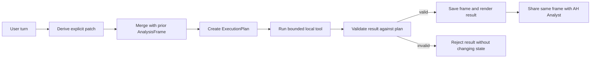

# Analysis Session State Spec

- purpose: define durable structured state shared by Alamo Platform chat, local analysis tools, and AH Analyst
- status: implemented current-state contract
- owners: product, frontend, backend
- updated: 2026-07-18
- tags: analyst, conversation, state, tools, validation, memory
- labels: architecture, implemented
- related files:
  - [alamo-platform-app/shared/query-intent-compiler.mjs](/Users/eric/CareEngineMain/alamo-platform-app/shared/query-intent-compiler.mjs)
  - [alamo-platform-app/shared/analysis-session-state.mjs](/Users/eric/CareEngineMain/alamo-platform-app/shared/analysis-session-state.mjs)
  - [alamo-platform-app/server/copilot-tools.mjs](/Users/eric/CareEngineMain/alamo-platform-app/server/copilot-tools.mjs)
  - [alamo-platform-app/server/claude-copilot.mjs](/Users/eric/CareEngineMain/alamo-platform-app/server/claude-copilot.mjs)
  - [alamo-platform-app/scripts/check-query-intent-compiler.mjs](/Users/eric/CareEngineMain/alamo-platform-app/scripts/check-query-intent-compiler.mjs)
  - [alamo-platform-app/scripts/check-analysis-session-state.mjs](/Users/eric/CareEngineMain/alamo-platform-app/scripts/check-analysis-session-state.mjs)

## Purpose

Stop treating each chat turn as an isolated string. Each successful analytical
turn produces a versioned `AnalysisFrame`, and each follow-up applies only its
explicit patch to that frame.

## State Contract

The frame stores:

- metric and category
- metric grain, such as `incident_events` versus `distinct_residents`
- detail, aggregate, comparison, trend, or profile mode
- periods
- grouping and requested fields
- export intent
- community and resident scope
- calculation type
- presentation intent for heatmap, multi-series, or exact-row refinement
- revision and source prompt

The frame contains filters and intent only. It does not persist result rows,
incident narratives, or other PHI.

## Turn Lifecycle

Initial full questions are compiled by
`shared/query-intent-compiler.mjs`. Referential follow-ups use the structured
frame to select the tool and generate a canonical bounded-tool request.
First-turn analytical questions also prefer the compiled frame when it carries a
clear analytical shape, such as metric grain, mode, grouping, calculation,
fields, export intent, or presentation. The older router remains a fallback for
fuzzy module-opening and surface-navigation requests.

Command Center includes an intent workbench that compiles a prompt without
running the data tool. It shows the interpreted prompt, frame, selected tool,
certified rail, fallback tool, and route strategy.

## Patch Semantics

- `Do it for April` replaces only the period.
- `Now San Pablo` replaces only community scope.
- `Export that` preserves filters and enables export.
- `Compare it with May` adds May to the active comparison.
- `Just totals` changes mode to aggregate and clears requested detail fields.
- `Switch this to a heatmap` preserves metric and scope while changing presentation.
- `Show exact rows` changes an incident module to validated detail grain.
- `Same for Medication Refusal` changes category without changing the incident domain.
- `How many people went AWOL in May` compiles to `metric: incidents`,
  `category: AWOL/Elopement`, `metricGrain: distinct_residents`, and
  `mode: aggregate`.
- `How many AWOL incidents in May` compiles to the same category and period but
  uses `metricGrain: incident_events`.
- `How is San Pablo?`, `San Pablo overview`, and `give me San Pablo topline`
  reset inherited metric, category, detail mode, periods, fields, and export state.
- `Now San Pablo` and `same for San Pablo` remain referential and preserve the
  current analytical subject.
- An explicit domain switch clears incompatible state. For example, `now show
  census` cannot inherit incident-detail fields or an incident category.
- Certified cache entries are accepted only when their tool family matches the
  current execution plan.

## Validation Contract

Before a result can update session state, validation checks:

- selected tool
- every requested period
- requested category
- requested metric grain, including resident-count versus event-count answers
- community/facility scope
- detail versus aggregate grain
- requested output fields
- grouping
- export artifact presence
- structured category membership for every returned detail row
- detail-row count versus the monthly category aggregate for the identical scope

Execution plans also carry a shared tool-capability contract. Current-state
tools, such as resident profiles, resident search, diagnosis mix, demographics,
length of stay, documentation gaps, and current medication profiles, reject
explicit historical periods before the tool runs. The rejection exposes a
structured `temporal_scope_mismatch` code and never substitutes today's roster
for a dated request.

Invalid results are replaced with an explicit plan-rejection response and the
previous frame remains active.

Every handled tool result can also expose a normalized `truthState`:
`valid_rows`, `verified_zero`, `summary_not_shown`, `not_loaded`, `stale`, or
`plan_rejected`. The analyst and renderer should use this state instead of
inferring confidence from row count or prose. For example, a loaded month with
zero matching AWOL rows is `verified_zero`, while a medication absent from a
legacy cumulative summary without governed MAR rows is `summary_not_shown`.

Category filters use the structured incident category. Narrative text that
mentions another event does not reclassify the row. For example, a Substance
Use incident whose narrative mentions returning from AWOL remains Substance Use.

## Persistence

- The browser stores the current non-PHI frame and session ID while the current
  page session is active, but the default home boot creates a fresh analysis
  session. Reloading the app starts clean unless the user explicitly opens a
  saved chat from History.
- The local tool server keeps a bounded 500-session working cache.
- Each session stores the last valid frame, a compact last-result summary, the last
  execution plan, and an update timestamp. It does not store result rows or
  incident narratives.
- Tool requests send the frame explicitly when available, but the server can
  recover the latest valid frame from `sessionId` when the client omits or loses
  the frame.
- Cached/certified answers also update the session frame when they produce a
  valid result.
- AH Analyst receives the same frame and recent visible turns.
- New Chat creates a new session ID and clears the frame. A browser reload does
  the same for the active workspace; saved chat history remains the intentional
  context-restore path.

## Verification

The generated benchmark currently covers 483 combinations across:

- referential wording
- period changes
- all five communities
- export wording
- category and mode changes
- common typo correction

It also runs live multi-turn sequences through the real local tools and includes
a negative test proving that a result missing a requested period is rejected.
Live checks also cover the resident-count versus incident-event distinction for
AWOL questions, plus server-side frame recovery for compile-only follow-ups,
tool follow-ups, and export follow-ups when the frontend does not pass an
explicit `analysisFrame`.

A separate cross-domain transition matrix runs 1,800 assertions across all five
communities, five incident categories, three periods, broad community resets,
referential community changes, census and medication domain switches, and
exports. This prevents old detail filters from contaminating a new broad
question inside the same thread.

The dedicated query-intent compiler check currently covers 15 compiled prompts
before any tool execution. The full analyst check now runs this compiler check
before tool-scope, ad hoc module, benchmark, session-state, and certified-rail
checks.

A second deterministic matrix covers 534 structured prompts across five
communities, six periods, three incident categories, event versus unique-person
grain, exact detail rows, exports, census, medication compliance, and
documentation. The live tool suite separately proves that a detail module and
its follow-up CSV export carry the same row-set fingerprint and row count.

Databricks now has a separate analyst-context QA notebook. It validates the
gold-view contracts and current incident detail-to-aggregate reconciliation
after `tool_context_views` and before `snapshot_publish`. This data gate and the
application language-routing suites are deliberately separate: Spark validates
published data contracts, while Node validates compiler, tool, response, and
conversation behavior.

## Command Center QA Contract

The daily `npm run qa:analyst` run writes a versioned artifact to
`generated/analyst-qa/latest.json`. Command Center renders that artifact as
operational evidence rather than a single pass-rate badge.

Each run records:

- exact passed, failed, and total prompt counts
- the current run timestamp and up to seven prior run summaries
- every failed prompt
- expected and actual tools
- expected period, category, and community scope
- actual period, category, community, and row count
- the failure stage: compiler, tool execution, plan validation, or formatting
- the concrete validation error returned by the execution plan

The web surface can refresh the published artifact immediately. Rerunning the
suite remains a pipeline or workspace action because executing the full suite
inside a short-lived web request would be unreliable. Command Center exposes
the exact rerun command instead of presenting a fake in-browser rerun. It also
reports snapshot age, serialized payload size against the configured ceiling,
and the number of historical incident-detail rows.

## Assumptions

- Existing bounded tools remain the source of calculations and rows.
- Follow-ups patch the structured frame rather than reparsing each turn as an isolated request.
- Browser persistence is acceptable for non-PHI analytical filters.
