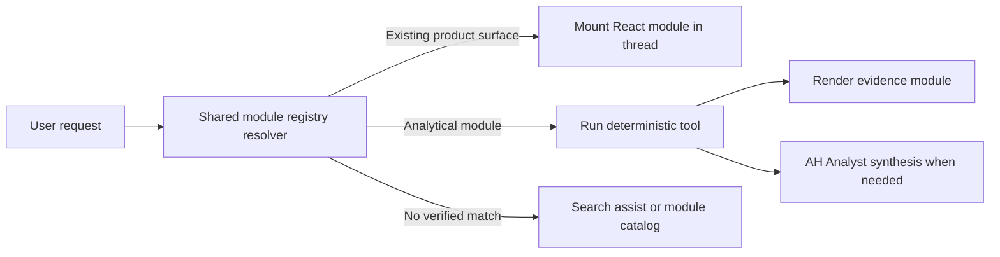

# Platform Module Registry

- purpose: define the reusable product and analytical module catalog used by the Alamo Analyst workspace
- status: implemented current-state contract
- owners: product, frontend, data platform
- updated: 2026-07-18
- tags: modules, analyst, canvas, tools, registry, ad-hoc-analysis
- labels: architecture, build-spec, active
- related files:
  - [alamo-platform-app/shared/platform-module-registry.mjs](/Users/eric/CareEngineMain/alamo-platform-app/shared/platform-module-registry.mjs)
  - [alamo-platform-app/shared/platform-module-registry.d.mts](/Users/eric/CareEngineMain/alamo-platform-app/shared/platform-module-registry.d.mts)
  - [alamo-platform-app/server/copilot-tools.mjs](/Users/eric/CareEngineMain/alamo-platform-app/server/copilot-tools.mjs)
  - [alamo-platform-app/src/features/home/pages/WorkspaceHomePage.tsx](/Users/eric/CareEngineMain/alamo-platform-app/src/features/home/pages/WorkspaceHomePage.tsx)
  - [docs/platform/analyst-system.md](/Users/eric/CareEngineMain/alamo-platform-app/docs/platform/analyst-system.md)

## Purpose

The registry is the shared inventory of reusable UI and analytical modules that
Alamo Analyst can select, mount, or run. It prevents natural-language requests
from falling through to unrelated generic charts when an exact product module
already exists.

## Status

The first registry release contains:

- 12 product surfaces
- 39 deterministic analytical modules
- shared route and alias resolution
- community-aware route construction
- a queryable module catalog tool
- scoped module context for AH Analyst
- integrity and end-to-end routing checks
- a versioned ad hoc module specification and template planner
- capped multi-module composition for explicit cross-domain questions

## Module Types

### Product surfaces

Product surfaces mount an existing React experience in the conversation. They
declare a canvas target, route template, scopes, aliases, data requirements,
and capabilities.

Examples:

- Communities Overview
- Community Detail
- Resident Search
- Community Census
- Community Incidents
- Community Residents
- Incident Center
- Data Explorer

### Analytical modules

Analytical modules point to deterministic tools and a preferred visual grammar.
The tool performs filtering, grouping, counting, joining, and calculation. AH
Analyst may explain the returned evidence but does not compute replacement rows.

Examples:

- Census Trend
- Census Movement
- Incident Category Breakdown
- All Incidents Search
- Census Search
- Resident Search
- Resident Incident Drivers
- Community Incident Drivers
- Metric Slice
- Incident Rate Change
- Resident Profile
- Diagnosis Mix
- Medication Compliance
- Medication Watch
- Medication Profile
- Medication Refusals
- Medication Refusal Detail
- Late Medication Administrations
- Held Medication Detail
- PRN Medication Detail
- Resident Medication Profile

## Ad Hoc Module Contract

Analytical tool results are converted into a versioned module specification
before rendering. The specification includes:

- stable module ID and registered analytical module ID
- visualization template
- portfolio, community, or resident scope
- active filters and period
- tool and source provenance
- supported interactions
- normalized visual rows with template-specific limits

The templates include trend line, multi-series trend, period heatmap,
composition donut, comparison bars, ranked bars, exact data table, resident
profile, topline summary, and simple categorical bars. Explicit multi-domain
questions may compose up to three valid modules; ordinary questions remain
single-module responses. Generated modules stay in the vertical question
timeline, where registered drilldowns rerun bounded tools against current
approved rows.

## Resolution Flow

## Decisions

- The registry is shared by browser and server code.
- Product surfaces and analytical modules remain distinct registry kinds.
- Existing components should be reused rather than visually recreated.
- Community-scoped routes use a facility parameter and optional focus target.
- Explicit module requests are deterministic and do not require an LLM call.
- AH Analyst receives only question-relevant module entries, not the entire
  registry, to control token use.
- Missing or ambiguous modules return recovery actions rather than an unrelated
  default module.
- Large row-set search/export workflows may hand off to the full-screen Data
  Explorer instead of rendering hundreds of rows in the chat thread.

## Assumptions

- Community-scoped product modules require an explicit facility. Unscoped
  requests fall back to Communities Overview rather than silently choosing a site.
- Registry aliases are product vocabulary, not a substitute for general query
  understanding or person-name correction.

## Extension Workflow

1. Add the module definition with stable ID, kind, family, aliases, scopes,
   data requirements, and capabilities.
2. For a product surface, provide a canvas target and route template.
3. For an analytical module, provide a deterministic tool and visual type.
4. Add registry integrity coverage and at least one end-to-end prompt case.
5. Verify that unavailable data produces an explicit empty or recovery state.
6. Update this document when a new module family or ownership boundary appears.
